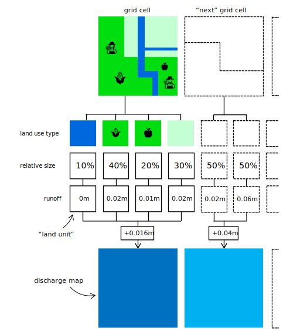

Hydrological response units
############################

Most geographical models, including hydrological models, work using cells. This is essentially an area on the map that responds as a unit. The resolution of the grid varies, depending on the required detail of the simulation, computational run-time, availablity of input data among others. (Near-) square cells are very useful in this respect, because input data (such as satellite observations) are often available in a grid. CWatM, like most hydrological models, operates at these grids. For each cell, various land use types are modelled, and then aggregated to the cell level while considering the relative sizes of the land use types in that particular cell. Farmers occupy non-irrigated land, paddy-irrigated land, and non-paddy irrigated land. However, when a single land use type is shared among multiple farmers, their hydrological environment is shared, and thus must respond identically.

This creates an issue for agent-based models, where implementation of heterogeneous decision-making is required. For example, when one farmer decides to irrigate and other does not, the soil moisture in their fields should also be represented separately. Therefore, we use the concept of `HRUs`. To create the `HRUs`, each individual field owned by a farmer becomes a `HRU` first. Then, in addition, each other land use type becomes a separate HRU. `HRUs` never cross cell boundaries. This means that farmers whose fields are dispersed across multiple cells are simulated by multiple `HRUs`. Here, we assume that each `HRU`, is relatively homogeneous as it each `HRU` is operated by 1) a single farmer, or by a single other (i.e., non-farm) land-use type and 2) never crosses the boundary a hydrological model cell. This concept is similar to hydrological response units (HRUs), but operates at the sub-grid level rather than the basin level and delineation of the units is performed differently.

.. image:: images/HRUs.png

The figure above displays how this works in practice. Grid cells in the hydrological model are separated by the regular horizontal and vertical black lines. The left panel displays the various land use types, the moddle panel the farmers that own the cropland, and the rightmost panel shows the resulting hydrological units. Note that each contiguous area in the middle and right panel of a single color is one field or hydrological unit respectively, while separated areas are different fields or hydrological units. One exception is the hydrological units of the same land use type that are not owned by agents. These are represented by a single hydrological unit if they are encompassed within a single cell.

While soil processes are simulated in the HRUs (e.g., percolation, capillary rise, and evapotranspiration), other hydrological processes such as discharge are calculated at the grid cell level. To this extent, the class :py:class:`HRUs.Data` also contains functions to convert from HRUs to grid cells (:meth:`HRUs.Data.to_HRU`) and vice versa (:meth:`HRUs.Data.to_grid`). The figure below shows how `runoff` from the HRUs is aggregated by considering relative sizes of the HRUs, and added to discharge. CWatM then solves the kinematic wave equation at the grid cell level.

.. automodule:: geb.HRUs
    :members: