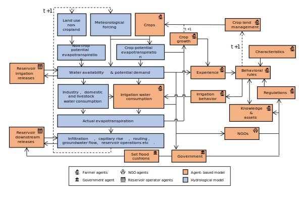
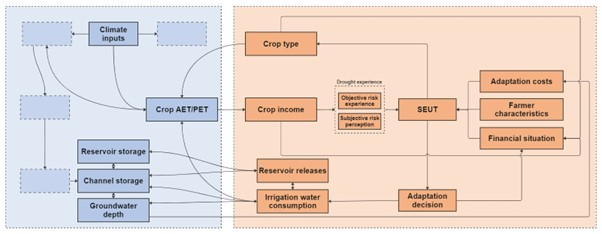
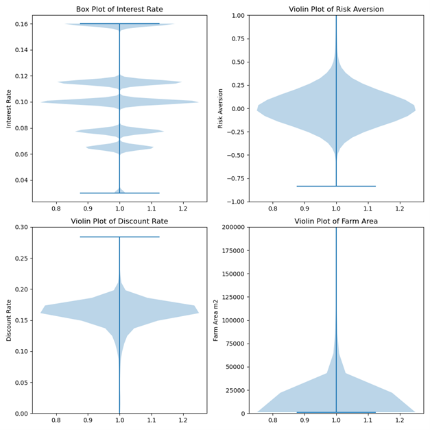

Supplementary information 1: ODD+D protocol 

Based on the protocol by Müller et al. (2013)

# Overview

## 1.1 Purpose

### 1.1.1 What is the purpose of the study?

The purpose of the study is to analyze dynamic drought risk over consecutive droughts. To do so, we use the Geographical, Environmental, and Behavioral model GEB (De Bruijn et al., 2023) . The model includes adaptive behavior of heterogeneous farmer agents that changes in response to varying hydroclimatic and socioeconomic conditions, while in turn also affecting those socio-hydrological conditions. The study is performed in the Bhima basin, India. 

### 1.1.2 For whom is the model designed?  

The model is designed for scientists and practitioners, particularly those interested in understanding how droughts affect adaptation of individual farmers over time and how that adaptation – in turn – affects droughts. 

## 1.2 Entities, state variables and scales 

### 1.2.1 What kinds of entities are in the model?

GEB includes an agent-based model (ABM) that governs the behavior of farmers and their interaction with the water cycle, as well as reservoir operators who manage water outflow from reservoirs. The ABM is coupled with a hydrological model Community Water Model (CWatM) that simulates the water cycle, availability and demand from non-agricultural sectors (e.g., domestic, energy, industry and livestock). Additionally, CWatM and the ABM are coupled to MODFLOW, which simulates the subsurface hydrology. For a full overview of CWatM and MODFLOW see (Burek et al., 2020) and (Langevin et al., 2017). 

### 1.2.2. By what attributes (i.e. state variables and parameters) are these entities characterized?

| Variable / Parameter                      | Definition, unit                                                                                                                                                                                                                                                                                     | Value / range                                                                                                                                                                         |
|-------------------------------------------|-------------------------------------------------------------------------------------------------------------------------------------------------------------------------------------------------------------------------------------------------------------------------------------------------------|--------------------------------------------------------------------------------------------------------------------------------------------------------------------------------------|
| **Location**                              | Where in the study area the farmers are situated (i.e., geographic coordinates of farmers)                                                                                                                                                                                                             |                                                                                                                                                                                      |
| **Elevation**                             | What elevation the farm is situated at (m above sea level).                                                                                                                                                                                                                                            |                                                                                                                                                                                      |
| **Farm size**                             | How large their farm size is.                                                                                                                                                                                                                                                                           | Classes are: 'Below 0.5' acres, '0.5-1.0', '1.0-2.0', '2.0-3.0', '3.0-4.0', '4.0-5.0', '5.0-7.5', '7.5-10.0', '10.0-20.0', '20.0 & ABOVE'. Size is randomly generated based on class.   |
| **Groundwater levels**                    | How far below the ground the groundwater is situated. (m) below ground                                                                                                                                                                                                                                  | Determined by MODFLOW, CWatM and groundwater extractions                                                                                                                              |
| **Irrigation class**                      | Whether farmer has used most irrigation water from groundwater, river channel or reservoirs                                                                                                                                                                                                            |                                                                                                                                                                                      |
| **Crop rotation**                         | Which crops the farmer are cultivating during the Kharif, Rabi and Summer seasons                                                                                                                                                                                                                       | Initially determined based on the Indian Agricultural Census and Indian Human Development Survey (see de Bruijn et al., 2023)                                                        |
| **Past yearly yield ratios**              | Array of past 20 years of average yield ratio over all seasons where farmer cultivated crops. (-)                                                                                                                                                                                                      | Determined by eq. 10 sect                                                                                                                                                            |
| **Past yearly potential and actual incomes** | Array of past 20 years of potential (if no water shortage) and actual (with water shortage, determined by yield ratio) income after selling crops. (Rs)                                                                                                                                                 | Determined by the crop, yield ratio and market prices                                                                                                                                |
| **Past yearly drought probabilities**     | Array of past 20 years of average Standardized Precipitation Evapotranspiration Index (SPEI) of all harvests. (-)                                                                                                                                                                                       | ~ +2 to -2                                                                                                                                                                            |
| **Yearly costs / outstanding loan payments and durations** | Yearly loan amount that farmers have to pay and how long they have to pay it for. Consists of agricultural input loans, microcredit loans and adaptation loans.                                                                                                                                          | Determined by crop choice, past crop failures and well adaptation decisions                                                                                                           |
| **Social parameters**                     | See sect. 2.1.4                                                                                                                                                                                                                                                                                       |                                                                                                                                                                                      |
| **$\sigma$**                                     | Risk aversion                                                                                                                                                                                                                                                                                         | See sect. 2.1.3 Mean: 0.02; STD: 0.82. (Just & Lybbert, 2009)                                                                                                                        |
| **r**                                     | Discount rate                                                                                                                                                                                                                                                                                         | See sect. 2.1.3 Mean: 0.159; STD: 0.193. (Bauer et al., 2012)                                                                                                                        |
| **r**                                     | Annual interest rate (%), coupled to land size classes.                                                                                                                                                                                                                                                | 16, 11.5, 10, 7.75, 6.5, 6.5, 6.5, 5, 3, 3                                                                                                                                           |
| **Risk perception**                       |                                                                                                                                                                                                                                                                                                       |                                                                                                                                                                                      |
| **$\beta$**                                     | Risk perception                                                                                                                                                                                                                                                                                       | See sect. 1.3.1 for calculation                                                                                                                                                      |
| **c**                                     | Maximum overestimation of risk, calibrated                                                                                                                                                                                                                                                             | Min: 2; Max: 10; Final: 4.32                                                                                                                                                         |
| **d**                                     | Risk reduction factor                                                                                                                                                                                                                                                                                  | -2.5                                                                                                                                                                                 |
| **e**                                     | Minimum underestimation of risk                                                                                                                                                                                                                                                                         | 0.01                                                                                                                                                                                 |
| **t**                                     | Time since last drought. (years)                                                                                                                                                                                                                                                                       | 0 to the maximum runtime.                                                                                                                                                            |
| **Calibrated parameters**                 |                                                                                                                                                                                                                                                                                                       |                                                                                                                                                                                      |
| **Base yield ratio**                      | The base yield ratio, used to adjust the mean yield ratio for calibration                                                                                                                                                                                                                               | Min: 0.4; Max: 1; Final: 0.99                                                                                                                                                        |
| **Expenditure cap**                       | The maximum yearly costs as a fraction of income farmers can spend on loans for adaptation/inputs/etc.                                                                                                                                                                                                 | Min: 0.2; Max: 0.5; Final: 0.30                                                                                                                                                      |
| **Drought threshold**                     | Drought loss threshold.  See sect 2.1.3                                                                                                                                                                                                                                                                | Min: 5; Max: 25; Final: 15.32                                                                                                                                                        |
| **Risk perception max c**                 | See risk perception above.                                                                                                                                                                                                                                                                             | Min: 2; Max: 10; Final: 4.32                                                                                                                                                         |

Table 1 Attributes and their values of farmer agents in GEB. “Min” and “max” refer to the minimum and maximum value used in calibration, while “Final” refers to the value resulting from the calibration process.

| Variable / Parameter               | Definition, unit                                                                         | Value / range                          |
|------------------------------------|------------------------------------------------------------------------------------------|----------------------------------------|
| **Minimum outflow**                | The minimum outflow that can be set if a baseflow needs to be guaranteed (% of average discharge) | 0.0                                    |
| **Non-damaging outflow Q**         | The maximum non-damaging outflow Q (% of average discharge)                              | 400.0                                  |
| **Normal Outflow Q**               | The normal outflow Q (% of average discharge)                                             | 1                                      |
| **Max reservoir release factor**   | Fraction of total reservoir storage to release for irrigating farmers daily (-)           | Min: 0.01; Max: 0.05; Final: 0.03      |

Table 2 Reservoir operator agents attributes and their values in GEB

CWatM and MODFLOW attributes. This table shows only the calibrated attributes. Full hydrological settings can be found in the CwatM.ini file on Zenodo (Kalthof & De Bruijn, 2024). 

| Variable / Parameter           | Definition, unit                                       | Value / range                    |
|--------------------------------|--------------------------------------------------------|----------------------------------|
| **Hydrological parameters (CWATM)** | (Burek et al., 2020; De Bruijn et al., 2023)           |                                  |
| **SnowMeltCoef***              | Snow melt coefficient. *not calibrated as no snow in study area | 0.004                            |
| **arnoBeta_add**               |                                                        | 0.14                             |
| **factor_interflow**           |                                                        | 0.76                             |
| **lakeAFactor**                |                                                        | 3.22                             |
| **lakeEvaFactor**              |                                                        | 2.45                             |
| **manningsN**                  |                                                        | 1.40                             |
| **normalStorageLimit**         |                                                        | 0.65                             |
| **preferentialFlowConstant**   |                                                        | 1.43                             |
| **recessionCoeff_factor**      |                                                        | 4.09                             |
| **soildepth_factor**           |                                                        | 1.77                             |
| **return_fraction**            |                                                        | 0.45                             |

Table 3 Calibrated CWatM attributes and their final values in GEB

### 1.2.3. What are the exogenous factors / drivers of the model?

The forcing data consisted of Precipitation (kg/m²/s), Surface Downwelling Longwave Radiation (W/m²), Surface Downwelling Shortwave Radiation (W/m²), Relative Humidity at Surface (%, hurs), Surface Pressure (Pa, ps), Surface Wind Speed (m/s), Near-Surface Air Temperature (K), Daily Maximum Near-Surface Air Temperature (K), Daily Minimum Near-Surface Air Temperature (K) and Wind Speed (m/s). This data was sourced from the CHELSA-W5E5 v1.0 observational climate input data at 30 arcsec horizontal and daily temporal resolution (Karger et al., 2022).

The routing was determined by identifying the outlet of the Upper Bhima basin and taking all upstream cells of it from the MERIT Hydro elevation map (Yamazaki et al., 2019), upscaled to 30'' (Eilander et al., 2021). Routing maps for river slope and width were also obtained in a similar manner (Eilander et al., 2020). Reservoir and lake footprints came from the HydroLAKES dataset (Messager et al., 2016). Where available, data on flood cushions and reservoir volumes were sourced from the Andhra Pradesh WRIMS database (https://apwrims.ap.gov.in/, last accessed on 7 September 2021). Land cover was determined from the land cover data of Jun et al. (2014). 

Historical water demand is taken from CWatM and consists of domestic, industry and livestock demand following the method of Wada et al. (2011). 

Crop cultivation costs are sourced from the Ministry of Agriculture and Farmers Welfare in Rupees (Rs) per hectare (https://eands.dacnet. Nic.in/Cost_of_Cultivation.htm, last access: 15 July 2022) (De Bruijn et al., 2023). Historical monthly crop market sell prices are sourced from Agmarknet (https://agmarknet.gov.in, last accessed on 27 July 2022) (De Bruijn et al., 2023) in Rupees (Rs) per kg.

### 1.2.4. If applicable, how is space included in the model?

Each field of a farmer is simulated as a single Hydrological Response Unit (HRU) (De Bruijn et al., 2023). The HRUs are dynamically sized based on the land ownership / field size of each farmer and are independently operated by each agent. This means that land management decisions such as crop rotation, planting dates and irrigation, along with soil processes like percolation, capillary rise, and evaporation, are independently simulated within a HRU for each farmer. This allows for the simulation of multiple independently operated farms within a single grid cell of CWatM (De Bruijn et al., 2023). The smallest HRU is at 30 m x 30 m, which is the resolution of the smallest cell of the land cover map. 

While vertical hydrological processes like infiltration and percolation are modeled within the HRUs, river discharge and groundwater flow are handled at the grid cell level of 30'' grid size. This requires converting fluxes from HRUs to grid cells. Runoff is calculated for each HRU, aggregated based on their sizes, and then integrated into the grid cell's discharge calculations.

### 1.2.5. What are the temporal and spatial resolutions and extents of the model?

In this study, the spatial extent model is the Upper Bhima basin, but it can be configured for any region globally by selecting the appropriate outflow grid point. For the spatial resolution see section 1.2.4. The temporal extent consists of a spin-up period between 1980 and 2001, and a run period from 2001 to 2015. 2001 was chosen as there was data in 2001 for how many and which farmers had irrigation wells. As the climate data started in 1979, the 12-month SPEI was available from 1980. The spin-up time between 1980 and 2001 was chosen to maximize the duration so that the drought probability-yield relation (or the “true/objective” drought risk) included as many drought events as possible.

CWatM processes run at a daily timestep, except routing, which runs at a hourly sub-timestep. The interaction between both, such as choosing to irrigate or to harvest crops, run at a daily timestep as well. Adaptation decisions (switching crops or digging wells) are made at the end of each growing season for the next one. 

## 1.3 Process overview and scheduling

### 1.3.1. What entity does what, and in what order?

Daily timestep: CWatM simulates all daily hydrological processes depending on, e.g., the meteorological forcing, land use types, crop potential evapotranspiration etc. Reservoir agents determine reservoir release based on the current reservoir storage and inflow plus a set minimum, normal and maximum outflow, flood cushion and maximum fill. This water is made available to be released into the river channel. The water made available for irrigating farmers is a set percentage of the total volume daily, which is first available to the most upstream agents, cascading downstream. In the same timestep, farmer agents then determine whether they will irrigate (depending on whether they have access to either reservoir water, river channel water or groundwater) and how much they will irrigate (which is determined by how much water the farmer’s crop is short from fully filling field capacity so that actual evapotranspiration equals potential evapotranspiration). This water is then abstracted and added from and to the corresponding storages in CWatM, and CWatM updates all appropriate stocks, this is done asynchronously, with elevation determining the order. Each agents then checks whether it is time to plant their crops if they have no current crops planted (depending on the crop rotation of the farmer and the start of the season) and adds the input costs to their yearly costs. Additionally, they check whether it is time to harvest if they currently have a crop planted (depending on when the crop was planted and how long that specific crop grows).

Figure 1 Overview of model actions, taken from De Bruijn et al. (2023). The government and NGO agents do not affect the model in this paper.

Farmers grow pearl millet, groundnut, sorghum, paddy rice, sugar cane, wheat, cotton, chickpea, maize, green gram, finger millet, sunflower and red gram. Each crop undergoes four growth stages (d1 to d4). The crop coefficient (Kc) is then calculated as follows (Fischer et al., 2021):

<!-- $$

Kc_t =
\begin{cases} 
  Kc1, & t < d_1 \\
  Kc1 + (t - d_1) \times \frac{Kc2 - Kc1}{d_2}, & d_1 \leq t < d_2 \\
  Kc2, & d_2 \leq t < d_3 \\
  Kc2 + (t - (d_1 + d_2 + d_3)) \times \frac{Kc3 - Kc2}{d_4}, & \text{otherwise}
\end{cases}

$$ -->

where t represents the number of days since planting, and d1 to d4 are the durations of each growth stage. Each crop has their own set of these parameters. At the harvest stage, the actual yield (Ya) is determined based on a maximum reference yield (Yr; Siebert & Döll, 2010), the water-stress reduction factor (KyT), and the ratio of actual evapotranspiration (AET) to potential evapotranspiration (PET) throughout the growth period (Fischer et al., 2021):

<!-- $$

Y_a = Y_r \times \left( 1 - KyT \times \left( 1 - \frac{\sum_{t=0}^{t=h} \text{AET}_t}{\sum_{t=0}^{t=h} \text{PET}_t} \right) \right)

$$ -->

After they harvest, yield is converted to income depending on the current market price of that specific crop. At the end of each season, farmers track their yield ratio of that harvest, their potential and actual profits and the 12-month SPEI of that season (from the 12-month SPEI between 1979 and 2016, calibrated from 1981-2010). They also check whether this season’s yield ratio is lower than a moving reference point plus a certain “drought threshold”. The reference point is the 5-year average difference between the reference potential yield and the actual yield, and the additional drought threshold is a calibrated factor. If it is below the moving average reference point and the drought threshold (e.g., 15% below the average yield of the last 5 years), the farmer experiences a drought. In that case, their time since the last drought (table 1) resets and their risk perception rises according to

<!-- $$

\beta_t = c \times 1.6^{-d \times t} + e

$$ -->

Where d is  a reduction factor, e is a minimum underestimation of risk and c is the maximum overestimation of risk. The amount that is below the threshold is then multiplied by the yearly average income and added as a two year loan (with interest) to yearly costs as microcredit. 

Growing season / yearly timestep: At growing season / yearly timestep the agents average those seasons’ SPEI probabilities and yield ratios. The farmers are then ordered into groups of farmers that have the same crop rotation, are in the same division of the river basin (upper / middle / lower) and have wells or not. The SPEI probability and yield ratios are averaged and a relation is made between all past SPEI probabilities and yield ratios (for calculation see section 3.4), which counts as their objective risk experience (i.e. the “objective truth” of what severity/probability drought leads to what severity yield loss) (figure 2). To decide whether they will dig a well or not, they use their own objective risk experience and subjective risk perception (i.e., after a drought overestimating the probability that droughts will happen), risk aversion and discount rate to calculate the subjective expected utility (SEUT) of not adapting. As wells both increase profits during non-drought years and reduce loss during drought years, the added benefit of wells is difficult to predict. Therefore, the SEUT of wells is calculated using the objective risk experience (i.e. relation between drought probability and yield) of the same group of farmers (in the same region of the basin, with the same crop rotation) that instead do have a well, but their personal subjective risk perception, risk aversion, discount rate, interest rate for loans, and well cost (which is dependent on the local groundwater depth). For calculation see section 3.4. If the SEUT of digging a well is higher and the price of adaptation is within the farmer’s budget constraints, they then adapt and the yearly loan amount (depending on well depth / cost, interest rate and loan duration, for calculation see section 3.4) is added to their yearly costs. This is done synchronously. To determine whether farmers will switch crops, all farmers calculate only their own crop rotation’s SEUT and objective EUT (using neutral risk perception, aversion and discount rate). Then, agents compare their current crop rotation’s SEUT with the EUT of max 5 random neighboring farmers using similar irrigation sources (within a 1 km radius, using reservoir, surface, groundwater or no irrigation). The EUT is used since using a neighbor’s SEUT would mean using another agent’s subjective factors. They then adopt the crop rotation of the neighbor who’s EUT is highest, if this exceeds their own SEUT. This is done asynchronously, following the same order as used for irrigation. 

Figure 2 Specific overview of the updated behavior in this study.

Design concepts

## 2.1 Theoretical and Empirical Background

### 2.1.1 Which general concepts, theories or hypotheses are underlying the model’s design at the system level or at the level(s) of the submodel(s)? What is the link to complexity and the purpose of the model?

The modelling approach in GEB is based on a quantitative socio-hydrology framework. In this framework, we assume two-way feedback between humans and the hydrological cycle, i.e. farmers both affect and are affected by the physical (drought) environment, but also between humans and economic factors such as changing market crop prices. Furthermore, the agent-based nature of GEB acknowledges the heterogeneity of actual farmers and attempts to capture this by varying social and physical factors to produce farmer agents that are similar to the ones we see in real life. 

### 2.1.2 On what assumptions is/are the agents’ decision model(s) based?

Agents are boundedly rational and use the subjective expected utility (SEUT) (Savage, 1954) to choose between actions they can take. They are further influenced by the adaptive choices of their neighbors, or “imitation” (source) and by elements of prospect theory (Kahneman & Tversky, 2013; Neto et al., 2023). 

### 2.1.3 Why are certain decision models chosen?

The SEUT builds on the EUT (Von Neumann & Morgenstern, 1947), by incorporating the concept of "bounded rationality", where agents remain rational utility maximizers but base their decisions on subjective estimates of drought probability. Their subjective estimates overestimate probabilities following a drought and underestimate probabilities after periods of no drought. Such boundedly rational behavior, observed in reality (Aerts et al., 2018; Kunreuther, 1996), aligns more closely with actual adaptation behavior than fully rational models (Haer et al., 2020; Wens et al., 2020). As the model’s application interest is in consecutive (drought) events, this behavioral theory fit our research goals best. 

However, literature indicates that human adaptive behavior is also influenced by social factors (Baddeley, 2010; Haer et al., 2016). Thus, agents also make decisions influenced by the (earlier) adaptive decisions and behavior of their neighbors. Lastly, farmers do not necessarily experience a meteorological drought as a drought, but experience drought when they experience crop loss, which is a factor of the meteorological drought, crop choice and irrigation capabilities (Van Loon et al., 2016). Furthermore, farmers also do not judge crop loss as a drought based on whether they have achieved the theoretical maximum yield if they never achieve this. Thus, we set that they only experience a drought if they have a loss against their expected gain or reference point, i.e., if the last 5 years they had  on average 60% of total yield, they will experience loss if it is below this 60%. This is based on how people experience loss which is described by elements of prospect theory (Kahneman & Tversky, 2013; Neto et al., 2023). The moving reference point can change based on farmer’s changed situation, e.g., if the farmer now uses irrigation and gets higher yields, if there has not been a drought for some time or if there has been a drought for a longer time (Neto et al., 2023) and yields were higher or if the farmer now has more drought resistant crops. 

### 2.1.4 If the model / a submodel (e.g. the decision model) is based on empirical data, where does the data come from?

Agent initialization: To generate heterogeneous farmer plots and agents with characteristics statistically similar to those observed within the Bhima basin, factors from the India Human Development Survey (IHDS, Desai et al., 2008), such as agricultural net income, farm size, irrigation type or household size, were combined with Agricultural census data (Department of Agriculture & Farmers Welfare India, 2001). For this, we use the iterative proportional fitting algorithm, which reweights IHDS survey data such that it fits the distribution of crop types, farm sizes and irrigation status at sub-district level reported in the Agricultural Census (De Bruijn et al., 2023). The farmer agents and their plots were randomly distributed over their respective sub-districts on land designated as agricultural land (Jun et al., 2014) at 1.5² resolution (50 meter at the equator). There were a total of 1432923 agents. The number of agents remained constant over the simulation period.

Risk aversion & discount rate: To set risk aversion and discount rate, we first normalized the distribution of agricultural net income. Then, as risk aversion and discount rate correlate with household income (Bauer et al., 2012; Just & Lybbert, 2009; Maertens et al., 2014), we rescaled the normalized income distribution with the mean and standard deviation of the (marginal) risk aversion  (0.02, 0.82; Just & Lybbert, 2009) and discount rate r (0.159, 0.193; Bauer et al.2012) of Indian farmers. Noise was added to both to prevent that each present-biased agent is also risk taking by definition.

Interest rates: To account for the variation in access to credit and interest rates among farmers, we assigned each agent an interest rate based on their total landholding size, with smaller farmers receiving higher and larger farmers lower rates (Table 4, Maertens et al., 2014; P. D. Udmale et al., 2015). This is based on the interest rates observed among Indian farmers (Hoda & Terway, 2015; Udmale et al., 2015). The average for all farmers comes out at approximately 10.6%, near the observed 10.7% of (Udmale et al., 2015). Below is the table relating landholding size to interest rate: 

| Size class (ha)    | < 0.5 | 0.5-1.0 | 1.0-2.0 | 2.0-3.0 | 3.0-4.0 | 4.0-5.0 | 5.0-7.5 | 7.5-10.0 | 10.0-20.0 | > 20.0 |
|--------------------|-------|---------|---------|---------|---------|---------|---------|-----------|------------|--------|
| **Interest rate (%)** | 16    | 11.5    | 10      | 7.75    | 6.5     | 6.5     | 6.5     | 5         | 3          | 3      |

Table 4 Interest rates per landholding size

Figure 3 Distributions of the farm sizes, risk aversion, discount and interest rates.

Calibration: We calibrated the model from 2001 to 2010 using observed daily discharge data and yield data. The daily discharge data was obtained from 5 discharge stations at various locations in the Bhima Basin from India-WRIS (https://indiawris.gov.in/wris/#/) . The yield data was obtained by dividing the total production by the total cropped area from (ICRISAT, 2015) to determine yield in tons per hectare. This figure was then divided by the reference maximum yield in tons per hectare to calculate the percentage of maximum yield. 

Crop market prices: Cultivation costs which include expenses such as purchasing seeds, manure, and labor are sourced from the Ministry of Agriculture and Farmers Welfare in Rupees (Rs) per hectare (https://eands.dacnet. Nic.in/Cost_of_Cultivation.htm, last access: 15 July 2022) (De Bruijn et al., 2023). Historical monthly market prices are sourced from Agmarknet (https://agmarknet.gov.in, last accessed on 27 July 2022) (De Bruijn et al., 2023) in Rupees (Rs) per kg.

### 2.1.5 At which level of aggregation were the data available?

The IHDS is reported at household level (Desai et al., 2008), the agricultural census data available at the sub-district level (Department of Agriculture & Farmers Welfare India, 2001) and the ICRISAT meso-level database are available at the sub-district level yearly (ICRISAT, 2015). Just & Lybbert (2009) and Bauer et al. (2012) were field study experiments done at the village level in Maharastra and Karnataka, respectively. Interest rates were at the national level (Hoda & Terway, 2015). 

## 2.2 Individual decision making

#### 2.2.1 What are the subjects and objects of decision-making? On which level of aggregation is decision-making modeled? Are multiple levels of decision making included?

Farmers make decisions between whether to change their crop rotation or stay with the same rotation, or whether to dig a well or do nothing. 

### 2.2.2 What is the basic rationality behind agents’ decision-making in the model? Do agents pursue an explicit objective or have other success criteria?

Households want to maximize their subjective expected utility. This is dependent on the effectiveness of wells given their crop yield & income and drought relation, which is affected by their crop rotation and past water availability. Furthermore, this is dependent on the yearly costs of wells, which is determined by the groundwater depth at their location and their interest rate. 

### 2.2.3 How do agents make their decisions?

Agents make decisions using the Subjective Expected Utility Theory, weighing the expected utility of digging a well against not digging one, and choosing the option that offers the highest utility. For crop choices, they compare the expected utility of their current crop rotation with that of their neighbors’ (with similar irrigation status), selecting the crop rotation that maximizes utility.

### 2.2.4 Do the agents adapt their behavior to changing endogenous and exogenous state variables? And if yes, how?

If agents switch their crops they adapt the yield – drought probability of their neighbor whom they copied. In combination with the new sell prices of their new crops, this changes the profitability of digging wells. Reversely, if a farmer digs a well, the increased water availability now changes the profitability of their crops, leading to different behavior. If loans are taken to adapt, the yearly costs change and thus the budget constraints are tighter. 

If total groundwater abstraction rises (either due to more water hungry crops or more agents with wells), groundwater levels decline and well prices rise and vice versa, leading to different behavior. Furthermore, if groundwater levels decline substantially, farmer’s wells can dry, which can lead to different yields and crop decisions. If more upstream agents abstract reservoir or channel water, there is less availability for downstream farmers, leading to different profits and behavior. If crop market prices change (either input or sell costs), their profitability changes, which can lead to different crop choices. 

If several years of increased yields follow, the drought reference level increases, leading to a different frequency of drought loss threshold exceedance and vice versa. Similarly, risk perception rises and falls in response to drought threshold exceedance (i.e. after a drought), leading to different behavior. 

If droughts occur, incomes go down and loans go up and budget constraint change. Vice versa for wet periods. If over a longer period of time droughts become more or less frequent or severe, the yield-drought probability relation changes and behavior changes. 

### 2.2.5 Do social norms or cultural values play a role in the decision-making process?

No. 

### 2.2.6 Do spatial aspects play a role in the decision process?

Climatic factors depend on the location of the farmer, the number of neighboring farmers / farmer density depends on the location (a higher density downstream and a lower density upstream), both these factors and the topography and hydrology determine the groundwater depth, which is thus also dependent on the location of the farmer. 

### 2.2.7 Do temporal aspects play a role in the decision process?

Farmers calculate the subjective time-discounted expected utility of each behavioral strategy by applying a decision horizon and a time discounting factor. Furthermore, the farmers have a “memory” of the past 20 years of yields and droughts, and use this to make predictions for future investments (through using the probability-yield relation in the expected utility). Lastly, just after a drought has been experienced, farmers risk perception is higher, and this goes down after time without a drought. 

### 2.2.8 To which extent and how is uncertainty included in the agents’ decision rules?

When farmers who do not have a well are grouped based on similarity and check their similar other farmer group that has adapted for how much yield gain per drought a well gives, a probability is given to the yield increase if the second group is much smaller than the first (e.g., the first has 100 farmers and the second only 5). The bigger the difference, the lower the probability. The probability becomes 100% if the groups are of equal size or the adapted group is bigger. If the probability estimation fails, we assume no added benefit. This is to prevent very few farmers from changing a much larger group (e.g., 3 farmers who have exceptional added benefit of wells cause 400 farmers to adapt). 

When searching for neighbors with similar irrigation status (reservoir, channel or groundwater), a random selection of neighbors is taken. 

## 2.3 Learning

### 2.3.1 Is individual learning included in the decision process? How do individuals change their decision rules over time as consequence of their experience?

Experience with droughts increases their risk experience and modifies their expected utility calculation and behavior. Second, through the “drought probability vs yield”-relation all farmers learn. This is both when more or less severe droughts are recorded, and the relation changes, but also when for example the farmers switches to a different crop rotation or suddenly has more water available. 

### 2.3.2 Is collective learning implemented in the model?

The drought probability – yield relation is calculated of averaged values of larger groups that are similar in terms of having wells, basin location and crop rotation. This grouping is done to get more robust relations for the “objective” relation between drought probability and yield. However, one farmer may have experienced slightly different past precipitation, and will thus learn from others’ drought experiences. 

### 2.3.3 Is collective learning implemented in the model?

## 2.4 Individual sensing 

### 2.4.1 What endogenous and exogenous state variables are individuals assumed to sense and consider in their decisions? Is the sensing process erroneous?

Farmers sense groundwater depths, well costs, irrigation class, risk perception, interest rates non-erroneous. Farmers sense future drought risk and yield, future benefits from wells and the expected utility of their own and neighbor’s (with similar irrigation status) crop rotation erroneously, as these are estimations based on past and partial (risk) information and also depend on future exogeneous state variables. 

### 2.4.2 What state variables of which other individuals can an individual perceive? Is the sensing process erroneous?

Farmers can sense the expected utility of other farmers with similar irrigation status’s crop rotation. As this process is erroneous for the farmer itself, it is also erroneous for the farmer sensing that of the other farmer. 

### 2.4.3 What is the spatial scale of sensing?

The relation between drought probability and yield is made for groups formed in the upper, middle and lower basin (regional). The expected utility of neighbors with similar irrigation status (reservoir, channel or groundwater)  is within a 1 km radius / local. All other sensing is done at the farmer’s own location. 

### 2.4.4 Are the mechanisms by which agents obtain information modeled explicitly, or are individuals simply assumed to know these variables?

The drought probability – yield relation, well costs and expected utilities are modelled explicitly, while the other factors are just known by farmers. 

### 2.4.5 Are costs for cognition and costs for gathering information included in the model?

No

## 2.5 Individual prediction 

### 2.5.1 Which data does the agent use to predict future conditions?

Farmer agents use the last 20 years of drought probability and yield relation plus their risk perception, adaptation costs and crop market prices to predict future conditions. 

### 2.5.2 Might agents be erroneous in the prediction process, and how is it implemented?

Yes. The drought probability-yield relation is based on the SPEI between 1979 and 2016 and events that happened to the farmer for the last 20 years and is assumed to be the fully “objective” drought risk. It thus does not know what their yield would be for an, e.g., severe drought that was not present in those last 20 years, or what a drought SPEI would be if it was not present during the 1979-2016 data series. Furthermore, when determining the added benefit of wells, it is assumed that they will remain able to extract water indefinitely, which can be changed if groundwater levels drop due to weather conditions or other agents extracting. Similarly, agents are not aware of future market price changes. 

## 2.6 Interaction 

### 2.6.1 Are interactions among agents and entities assumed as direct or indirect?

Direct among agents through neighbor expected utility sharing and through calculating the drought probability-yield relation. Indirect through accessing shared irrigation resources, i.e., groundwater, channel water and reservoir water. 

### 2.6.2 On what do the interactions depend?

Whether farmers are similar (drought probability-yield relations) and their spatial location (upstream/downstream, many agents abstracting groundwater or relatively few, inside neighbor radius or outside). 

### 2.6.3 If the interactions involve communication, how are such communications represented?

Communication for crop switching is limited to a spatial radius of 1 km of neighboring farmers with similar irrigation status (reservoir, channel or groundwater), from which a random group of 5 farmers is selected. For determining the drought probability-yield relation the communication is limited to farmers that are similar in terms of well status, basin location and crop rotation. 

### 2.6.4 If a coordination network exists, how does it affect the agent behaviour? Is the structure of the network imposed or emergent?

The group of neighbors to which farmers compare the expected utility of their own crop rotation is randomized each year. 

## 2.7 Collectives 

### 2.7.1 Do the individuals form or belong to aggregations that affect, and are affected by, the individuals? Are these aggregations imposed by the modeller or do they emerge during the simulation?

For every farmer in the Bhima basin, we model one farmer agent (or “one-to-one” scale), thus there is no initial aggregation of agents. We do this first and foremost because we do not know what a representative agent for our area is (Page, 2012) and by pre-emptively aggregating agents, we may lose interactions that we were not aware existed in the first place (Page, 2012). This is especially true in an area as heterogeneous as the Bhima basin in India, where there are extreme differences in landholder size (Desai et al., 2008), which factor through in other agent attributes such as which crops they initially cultivate (Department of Agriculture & Farmers Welfare India, 2001), their access to credit or their social factors (Hoda & Terway, 2015; Maertens et al., 2014; Udmale et al., 2015). Aggregating while coupling to a hydrological model may also give additional issues. For example, without aggregation, if a small farmer HRU is next to a larger farmer HRU, but share the same modflow cell, they directly experience the additional groundwater decline as a result of the larger farmer extracting. If agents were aggregated and scaled, cells of groundwater would need to be crossed by the water before the decline affects each adjacent farmer. Furthermore, the idea of “representative individuals” is in itself disputed and aggregating agents, even if they are all rational utility maximizers, can lead to wrong conclusions  (Axtell & Farmer, 2022; Kirman, 1992). Secondly, the vectorized design of GEB allows us to simulate more agents with only a relatively low increase in computational demand. Lastly, although it is not researched whether this has benefited the current analysis, the first step to determine the effects of aggregation is ensuring that modelling at the highest detail is possible. 

During the model run, farmers are aggregated into groups that are similar in terms of well status, basin location and crop rotation. The yearly values of the drought probability and yield of those groups are averaged to determine the drought probability – yield relation. These aggregations are initially imposed by the modeler, but change throughout the simulation as agent’s well status and crop rotation changes. For comparing the expected utility of farmer’s current crop rotation and that of potential different farmer, neighboring farmers with similar irrigation status within a spatial radius of 1 km are searched, from which a random group of max 5 farmers is selected and the expected utilities are compared.

### 2.7.2 How are collectives represented?

As a property based on a predefined combination of traits (well status, basin location and crop rotation). 

## 2.8 Heterogeneity  

### 2.8.1 Are the agents heterogeneous? If yes, which state variables and/or processes differ between the agents?

Agents are heterogeneous in spatial location, which affects climatic conditions and hydrological conditions (proximity to a river or reservoir, reservoir size, upstream or downstream, groundwater depth). Agents are also heterogeneous in socio-economic conditions: they vary in accessible interest rates, discount rate and risk aversion. Farmers are heterogeneous in agricultural conditions: there are 300 different unique crop rotations, different farm sizes, differences in initial well status. 

### 2.8.2 Are the agents heterogeneous in their decision-making? If yes, which decision models or decision objects differ between the agents?

Although the objective risk experience is made by aggregating the farmers into groups based on similarities, adaptation decisions are made on a personal level with all their personal characteristics (which are also dependent on earlier personal decisions, such as the yearly loan costs).

## 2.9 Stochasticity  

#### 2.9.1 What processes (including initialization) are modeled by assuming they are random or partly random?

When farmers who do not have a well are grouped based on similarity and check their similar other farmer group that has adapted for how much yield gain per drought a well gives, a probability is given to the yield increase if the second group is much smaller than the first (e.g., the first has 100 farmers and the second only 5). The bigger the difference, the lower the probability. . If the probability estimation fails, we assume no added benefit. This is to prevent very few farmers from changing a much larger group (e.g., 3 farmers who have exceptional added benefit of wells cause 400 farmers to adapt). 

When searching for neighbors with similar irrigation status (reservoir, channel or groundwater), a random selection of neighbors is taken from the found group each time. To account for stochasticity, the model had been run 60 times and the averages of these runs have been taken. 

During initialization, the farmer agents and their plots are randomly distributed over their respective sub-districts on land designated as agricultural land, which is based on the maps of Jun et al. (2014). 

## 2.10 Observation 

### 2.10.1 What data are collected from the ABM for testing, understanding, and analyzing it, and how and when are they collected?

GEB includes the options to report daily, monthly or yearly on all parameters. These are exported as arrays of values of the farmers. These are how much each farmer irrigates per source, their elevation, which crops they cultivate during which seasons, the groundwater depth at their location, the monthly 12-month SPEI, risk perception, yearly income, yearly yield ratio, loan payments, whether they are adapted, discharge at multiple hydrological stations, precipitation, reservoirs storages. 

### 2.10.2 What key results, outputs or characteristics of the model are emerging from the individuals? (Emergence)

See the main text for the analysis. 

Details

## 3.1 Implementation details 

### 3.1.1 How has the model been implemented?

Python 3 is used to implement the model, incorporating compiled Python libraries like NumPy (Harris et al., 2020) and Numba (Lam et al., 2015) for computationally intensive parts. Additionally, it features optional GPU vectorization of soil components via CuPy.

### 3.1.2 Is the model accessible and if so where?

The most recent version of the GEB and adapted CWatM model, as well as scripts for data acquisition and model setup can be found on GitHub (github.com/GEB-model). The model inputs, parametrization and code used for this manuscript are accessible through Zenodo (Kalthof & De Bruijn, 2024). This page also includes the averages and standard deviations of the 60 runs of the adaptation and non-adaptation scenario which are featured in all figures. 

## 3.2 Initialization

### 3.2.1 What is the initial state of the model world, i.e. at time t=0 of a simulation run?

At the start of the spin-up in 1980 there are 1432923 farmers that have a personal interest rate, discount rate, risk aversion irrigation source, crop rotation, farm size, location and elevation. These agents remained constant over the simulated period. There are reservoirs with a certain capacity that is 90% filled and their reservoir command areas that determine which farmers have access, there are certain soil properties per land cover type and river routing information. During the spin-up there is no switching of crops or digging wells, but farmers are able to irrigate if they have access to an irrigation source. 

At the end of this spin-up, all farmer parameters (table 1) are saved (including the past 20 years of drought probabilities and yields). In 2001, the “run” starts with the same values as where the spin-up ended, during which farmers can choose to dig a well or change their crop rotation. 2001 was chosen as there was data in 2001 for how many and which farmers had irrigation wells. As the climate data started in 1979, the 12-month SPEI was available from 1980. The spin-up time between 1980 and 2001 was chosen to maximize the duration so that the drought probability-yield relation (or the “true/objective” drought risk) included as many drought events as possible. 

### 3.2.2 Is the initialisation always the same, or is it allowed to vary among simulations?

The initialization is always the same 

### 3.2.3 Are the initial values chosen arbitrarily or based on data?

Almost all initial values are chosen based on data. See section 2.1.4. Initial groundwater levels at the spin-up were not based on data, which we would recommend for future studies. 

## 3.3 Input data

### 3.3.1 Does the model use input from external sources such as data files or other models to represent processes that change over time?

Yes, see section 1.2.3. 

## 3.4 Submodels

### 3.4.1 What, in detail, are the submodels that represent the processes listed in ‘Process overview and scheduling’?

For a full overview of CWatM and MODFLOW see (Burek et al., 2020) and (Langevin et al., 2017).

The following submodels were not described yet in process overview and scheduling: 

Submodel expected utility calculations: 

<!-- $$

\text{SEUT}_{\text{no\_action}} = \int_{p_2}^{p_1} \beta_t \times p_i \times U \left( \sum_{t=0}^{T} \frac{\text{Inc}_{i,x,t}}{(1 + r)^t} \right) dp

$$

$$

\text{SEUT}_{\text{tube\_well}} = \int_{p_2}^{p_1} \beta_t \times p_i \times U \left( \sum_{t=0}^{T} \frac{\text{Inc}_{i,x,t}^{\text{adapt}} - C_{t,d}^{\text{adapt}}}{(1 + r)^t} \right) dp

$$

$$

\text{SEUT}_{\text{own\_crop\_rotation}} = \int_{p_2}^{p_1} \beta_t \times p_i \times U \left( \sum_{t=0}^{T} \frac{\text{Inc}_{i,x,t} - C_{t,m}^{\text{input}}}{(1 + r)^t} \right) dp

$$

$$

\text{EUT}_{\text{own\_crop\_rotation}} = \int_{p_2}^{p_1} p_i \times U \left( \sum_{t=0}^{T} \frac{\text{Inc}_{i,x,t} - C_{t,m}^{\text{input}}}{(1 + r)^t} \right) dp

$$ -->

Utility U(x) is a function of expected income Inc and potential adapted income Incadapt per event i and adaptation costs Cadapt. In eq. 2, Cadapt is dependent on groundwater levels and in eq. 4 on current market prices. To calculate the utility of all decisions, we take the integral of the summed and time (t, years) discounted (r) utility under all possible events i with a probability of pi and adjust pi with the subjective risk perception $\beta$t. See table B1 for an overview of all model parameters. The utility U (x) as a function of risk aversion $\sigma$ is as follows:

<!-- $$

U(x) = \frac{x^{1-\sigma}}{1-\sigma}

$$ -->

Submodel drought probability – yield calculations:

The SPEI relation is fitted with by determining a and b in  following formula, which was chosen as it they returned the highest R-squared between drought probability and yield ratio for this region (~ 0.50): 

<!-- $$

\text{SPEI}_{i,t} = a \times \log_2\left( \text{yield}_{i,t} \right) + b

$$ -->

Submodel annual well investment costs calculations:

Annual investment cost: The yearly adaptation costs are a function of the well depth, the pump’s horsepower (HP), its maintenance costs and the cost of groundwater pumping. This is adjusted for the loan duration (n) using the agent’s yearly interest rate (r). 

<!-- $$

C_{t,d}^{\text{adapt}} = \left( C_D + C_{HP} \right) \times \frac{r \times (1 + r)^n}{(1 + r)^n - 1} + C_M + C_I

$$ -->

Borewell construction cost: The borewell construction cost is dependent on the probability of well failure (prD) and the groundwater depth for the agent (D). The constants are adjusted yearly based on inflation. 

<!-- $$

C_{t,d}^{\text{adapt}} = \left( C_D + C_{HP} \right) \times \frac{r \times (1 + r)^n}{(1 + r)^n - 1} + C_M + C_I

$$ -->

Initial borewell depth: Initial borewell depth (DI) of agents who had wells before the adaptation started was based on the average groundwater depth in the Bhima basin + 20 m. 

<!-- $$

C_{HP} = 3570 \times HP

$$ -->

Pump Cost: The pump cost is dependent on the horsepower (HP) of the pump. The constant is adjusted yearly based on inflation.

<!-- $$

C_M = 6598 \times W^{0.16}

$$ -->

Irrigation maintenance cost: The irrigation maintenance cost is dependent on the potential amount of water pumped (W). The constant is adjusted yearly based on inflation. 

<!-- $$

W_t = FR \times L \times A_t \times pr_I

$$ -->

Potential amount of water: The potential amount of water pumped is dependent on the flow rate (FR), the total planted time (L), the number of hours pumping per day (At) and the proportion of available water for pumping prI. 

<!-- $$

W_t = FR \times L \times A_t \times pr_I

$$ -->

Flow rate: The flow rate is dependent on the groundwater table (G). 

<!-- $$

FR = 79.93 \times G^{-0.728}

$$ -->

Cost of groundwater pumping: The yearly cost of groundwater irrigation (CI)  is dependent on the total planted time (L), the number of hours pumping per day (At), the proportion of available water for pumping prI, the electric power (E) and the electricity unit costs (CE). 

<!-- $$

C_I = L \times A_t \times pr_I \times E \times C_E

$$ -->

Electric power (kilowatt hour): The electric power is dependent on the horsepower  (HP) to watt conversion. 

<!-- $$

E = 745.7 \times HP

$$ -->

### 3.4.2 What are the model parameters, their dimensions and reference values?

| Variable / Parameter                         | Definition, unit                                           | Value / range                                         |
|----------------------------------------------|------------------------------------------------------------|------------------------------------------------------|
| **Cadapt**                                   | Annual irrigation investment cost (Rs)                     | See 3.4.1                                            |
| **D**                                        | Depth of Borewell (m)                                       | Current groundwater depth + 20 m                     |
| **DI**                                       | Initial depth of borewell of agents with well during spin-up | 42.5 m                                               |
| **prD**                                      | Probability of well failure                                 | 0.2                                                  |
| **Lifespan = Loan duration (n) = Time horizon (Rt)** | Years                                                       | 30                                                   |
| **CD**                                       | Cost of drilling well                                       | See 3.4.1                                            |
| **Cm**                                       | Maintenance costs (Rs)                                      | See 3.4.1                                            |
| **W**                                        | Potential amount of water pumped                            | See 3.4.1                                            |
| **FR**                                       | Flow rate (cubic meter per hour)                            | See 3.4.1                                            |
| **PrI**                                      | Proportion of available water for irrigation                | 1                                                    |
| **HP**                                       | Pump horse power (HP)                                       | 10                                                   |
| **CHP**                                      | Pump unit purchase costs (Rs)                               | See 3.4.1                                            |
| **At**                                       | Daily power supply (hours per day)                          | 3.5                                                  |
| **L**                                        | Total planted time (days)                                   | Dependent on agent crop rotation, total nr of days crop is planted. |
| **CI**                                       | Cost of pumping (Rs)                                        | See 3.4.1                                            |
| **E**                                        | Electric power used for irrigation (Rs per kilowatt hour)    | See 3.4.1                                            |
| **H**                                        | Number of hours pumping                                     | See 3.4.1                                            |
| **CE**                                       | Electricity unit costs (Rs per kilowatt hour)               | 0                                                    |

Table 5 Well cost parameters and their values in GEB

See table 1, 2, 3 and 4. 

Aerts, J. C. J. H., Botzen, W. J., Clarke, K. C., Cutter, S. L., Hall, J. W., Merz, B., Michel-Kerjan, E., Mysiak, J., Surminski, S., & Kunreuther, H. (2018). Integrating human behaviour dynamics into flood disaster risk assessment. Nature Climate Change, 8(3), 193–199. https://doi.org/10.1038/s41558-018-0085-1

Baddeley, M. (2010). Herding, social influence and economic decision-making: Socio-psychological and neuroscientific analyses. Philosophical Transactions of the Royal Society B: Biological Sciences, 365(1538), 281–290. https://doi.org/10.1098/rstb.2009.0169

Bauer, B. M., Chytilová, J., & Morduch, J. (2012). Behavioral Foundations of Microcredit : Experimental and Survey Evidence from Rural India Author ( s ): Michal Bauer , Julie Chytilová and Jonathan Morduch Source : The American Economic Review , APRIL 2012 , Vol . 102 , No . 2 ( APRIL 2012 ), pp . Publis. 102(2), 1118–1139.

Burek, P., Satoh, Y., Kahil, T., Tang, T., Greve, P., Smilovic, M., Guillaumot, L., Zhao, F., & Wada, Y. (2020). Development of the Community Water Model (CWatM v1.04) - A high-resolution hydrological model for global and regional assessment of integrated water resources management. Geoscientific Model Development, 13(7), 3267–3298. https://doi.org/10.5194/gmd-13-3267-2020

De Bruijn, J. A., Smilovic, M., Burek, P., Guillaumot, L., Wada, Y., & Aerts, J. C. J. H. (2023). GEB v0. 1: a large-scale agent-based socio-hydrological model–simulating 10 million individual farming households in a fully distributed hydrological model. Geoscientific Model Development, 16(9), 2437–2454.

Department of Agriculture & Farmers Welfare India. (2001). Agricultural Census India. National Informatics Centre (NIC)| Agriculture Census Division, DAC. agcensus1.da.gov.in

Desai, S., Dubey, A., Joshi, B. L., Sen, M., Shariff, A., & Vanneman, R. (2008). India human development survey. College Park, Maryland: University of Maryland. https://doi.org/https://doi.org/10.3886

Eilander, D., Van Verseveld, W., Yamazaki, D., Weerts, A., Winsemius, H. C., & Ward, P. J. (2021). A hydrography upscaling method for scale-invariant parametrization of distributed hydrological models. Hydrology and Earth System Sciences, 25(9), 5287–5313.

Eilander, D., Winsemius, H. C., Van Verseveld, W., Yamazaki, D., Weerts, A., & Ward, P. J. (2020). MERIT Hydro IHU, Zenodo [data set].

Fischer, G., Nachtergaele, F. O., Van Velthuizen, H. T., Chiozza, F., Franceschini, G., Henry, M., Muchoney, D., & Tramberend, S. (2021). Global agro-ecological zones v4–model documentation. Food & Agriculture Org.

Haer, T., Botzen, W. J. W., & Aerts, J. C. J. H. (2016). The effectiveness of flood risk communication strategies and the influence of social networks-Insights from an agent-based model. Environmental Science and Policy, 60, 44–52. https://doi.org/10.1016/j.envsci.2016.03.006

Haer, T., Husby, T. G., Botzen, W. J. W., & Aerts, J. C. J. H. (2020). The safe development paradox: An agent-based model for flood risk under climate change in the European Union. Global Environmental Change, 60(December 2018), 102009. https://doi.org/10.1016/j.gloenvcha.2019.102009

Harris, C. R., Millman, K. J., Van Der Walt, S. J., Gommers, R., Virtanen, P., Cournapeau, D., Wieser, E., Taylor, J., Berg, S., & Smith, N. J. (2020). Array programming with NumPy. Nature, 585(7825), 357–362.

Hoda, A., & Terway, P. (2015). Credit policy for agriculture in India: An evaluation. Supporting Indian farms the smart way. Rationalising subsidies and investments for faster, inclusive and sustainable growth. Working Paper.

ICRISAT. (2015). Meso level data for India: 1966-2011, collected and compiled under the project on Village Dynamics in South Asia. https://vdsa.icrisat.org/Include/document/all-apportioned-web-document.pdf

Jun, C., Ban, Y., & Li, S. (2014). Open access to Earth land-cover map. Nature, 514(7523), 434.

Just, D. R., & Lybbert, T. J. (2009). Risk averters that love risk? Marginal risk aversion in comparison to a reference gamble. American Journal of Agricultural Economics, 91(3), 612–626. https://doi.org/10.1111/j.1467-8276.2009.01273.x

Kahneman, D., & Tversky, A. (2013). Prospect theory: An analysis of decision under risk. In Handbook of the fundamentals of financial decision making: Part I (pp. 99–127). World Scientific.

Kalthof, M. W. M. L., & De Bruijn, J. (2024). Adaptive Behavior of Over a Million Individual  Farmers Under Consecutive Droughts: A Large-Scale Agent-Based Modeling Analysis in the Bhima Basin, India [Data set and Code]. Zenodo. https://doi.org/10.5281/zenodo.11071746

Kunreuther, H. (1996). Mitigating disaster losses through insurance. Journal of Risk and Uncertainty, 12, 171–187.

Lam, S. K., Pitrou, A., & Seibert, S. (2015). Numba: A llvm-based python jit compiler. Proceedings of the Second Workshop on the LLVM Compiler Infrastructure in HPC, 1–6.

Langevin, C. D., Hughes, J. D., Banta, E. R., Niswonger, R. G., Panday, S., & Provost, A. M. (2017). Documentation for the MODFLOW 6 Groundwater Flow Model. In Techniques and Methods. https://doi.org/10.3133/tm6A55

Maertens, A., Chari, A. V., & Just, D. R. (2014). Why farmers sometimes love risks: Evidence from India. Economic Development and Cultural Change, 62(2), 239–274. https://doi.org/10.1086/674028

Messager, M. L., Lehner, B., Grill, G., Nedeva, I., & Schmitt, O. (2016). Estimating the volume and age of water stored in global lakes using a geo-statistical approach. Nature Communications, 7(1), 13603.

Müller, B., Bohn, F., Dreßler, G., Groeneveld, J., Klassert, C., Martin, R., Schlüter, M., Schulze, J., Weise, H., & Schwarz, N. (2013). Describing human decisions in agent-based models–ODD+ D, an extension of the ODD protocol. Environmental Modelling & Software, 48, 37–48.

Neto, G. G. R., Kchouk, S., Melsen, L. A., Cavalcante, L., Walker, D. W., Dewulf, A., Costa, A. C., Martins, E. S. P. R., & Oel, P. R. Van. (2023). HESS Opinions : Drought impacts as failed prospects. 4217–4225.

Page, S. E. (2012). Aggregation in agent-based models of economies. In Knowledge Engineering Review (Vol. 27, Issue 2, pp. 151–162). https://doi.org/10.1017/S0269888912000112

Savage, L. J. (1954). The foundations of statistics; jon wiley and sons. Inc.: New York, NY, USA.

Siebert, S., & Döll, P. (2010). Quantifying blue and green virtual water contents in global crop production as well as potential production losses without irrigation. Journal of Hydrology, 384(3–4), 198–217.

Udmale, P., Ichikawa, Y., Manandhar, S., Ishidaira, H., Kiem, A. S., Shaowei, N., & Panda, S. N. (2015). How did the 2012 drought affect rural livelihoods in vulnerable areas? Empirical evidence from India. International Journal of Disaster Risk Reduction, 13, 454–469. https://doi.org/10.1016/j.ijdrr.2015.08.002

Van Loon, A. F., Gleeson, T., Clark, J., Van Dijk, A. I. J. M., Stahl, K., Hannaford, J., Di Baldassarre, G., Teuling, A. J., Tallaksen, L. M., Uijlenhoet, R., Hannah, D. M., Sheffield, J., Svoboda, M., Verbeiren, B., Wagener, T., Rangecroft, S., Wanders, N., & Van Lanen, H. A. J. (2016). Drought in the Anthropocene. Nature Geoscience, 9(2), 89–91. https://doi.org/10.1038/ngeo2646

Von Neumann, J., & Morgenstern, O. (1947). Theory of games and economic behavior, 2nd rev.

Wada, Y., Van Beek, L. P. H., & Bierkens, M. F. P. (2011). Modelling global water stress of the recent past: On the relative importance of trends in water demand and climate variability. Hydrology and Earth System Sciences, 15(12), 3785–3808. https://doi.org/10.5194/hess-15-3785-2011

Wens, M., Veldkamp, T. I. E., Mwangi, M., Johnson, J. M., Lasage, R., Haer, T., & Aerts, J. C. J. H. (2020). Simulating Small-Scale Agricultural Adaptation Decisions in Response to Drought Risk: An Empirical Agent-Based Model for Semi-Arid Kenya. Frontiers in Water, 2(July), 1–21. https://doi.org/10.3389/frwa.2020.00015

Yamazaki, D., Ikeshima, D., Sosa, J., Bates, P. D., Allen, G. H., & Pavelsky, T. M. (2019). MERIT Hydro: A High-Resolution Global Hydrography Map Based on Latest Topography Dataset. Water Resources Research, 55(6), 5053–5073. https://doi.org/10.1029/2019WR024873

