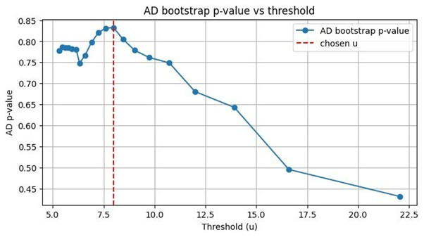

# Extreme Value Analysis

Extreme value analysis (EVA) is used in GEB to estimate the magnitude of extreme value events (like floods and windstorms) for different return periods. For example, "What discharge level would we expect once every 100 years?"

## Overview

GEB uses the Generalized Pareto Distribution Peaks-Over-Threshold (GPD-POT), fitted using L-moments, to estimate return periods for river discharge[@pan2022peaks]. This method is particularly good at modeling the tail behavior of extreme value events.

## How it works

### Step 1: Input data

We start with a time series of observational data (e.g., discharge from the hydrological module). The analysis supports data at any temporal resolution (e.g., hourly, daily). 

To ensure the statistical independence of the extreme events (de-clustering), we extract peaks from the time series using a minimum distance constraint. By default, GEB requires a 7-day separation between consecutive peaks. This ensures that multiple measurements of the same event are not treated as independent events with high auto-correlation.

### Step 2: Threshold selection

The GPD-POT method only looks at values that exceed a certain threshold. To pick a certain threshold is usually very important as we slice the input data and only look at values above that threshold:

- **Too low**: Violates the assumption that only extreme values follow the GPD
- **Too high**: Too few data points to fit the distribution reliably

Currently, there is an automatic scan method that evaluates multiple threshold candidates, typically from the 80th to 99th percentile of the observational data. GEB supports two selection strategies to determine the optimal threshold $u$ based on Anderson-Darling (AD) p-values:

- **`first_significant`** (default): This strategy scans thresholds starting from the most extreme (e.g., 99th percentile) and moving downwards. It selects the first threshold where the AD p-value exceeds a predefined significance level (default 0.10). This approach prioritizes higher thresholds, which are theoretically more likely to follow a GPD, while ensuring a statistically acceptable fit.
- **`best_fit`**: This strategy evaluates all candidate thresholds within the scanning range and selects the one that achieved the highest absolute p-value[@solari2017peaks]. This ensures the best possible statistical fit to the observed data, although it may occasionally result in lower thresholds if that leads to a more robust distribution.

In both cases, a minimum of 30 exceedances is required for a threshold to be considered valid for fitting.

### Step 3: Fit the GPD distribution

For values exceeding the threshold (called "exceedances"), the GPD distribution is fitted using two parameters:

- **sigma (σ)**: Scale parameter - controls the spread of the distribution.
- **xi (ξ)**: Shape parameter - controls the tail behavior:
    - **ξ > 0**: Heavy tail (Frechet-like), meaning extreme events are more likely.
    - **ξ = 0**: Exponential tail (Gumbel-like), where extremes decay exponentially.
    - **ξ < 0**: Short tail (Weibull-like), where the distribution is bounded by a maximum value.

#### Parameter estimation using L-moments

GEB uses the method of L-moments[@hosking2018lmoments] to estimate the GPD parameters. L-moments are expectations of linear combinations of order statistics. They are often preferred over the method of moments (ordinary moments) or maximum likelihood estimation (MLE) because L-moments are much less sensitive to outliers in the data, and generally provide less biased parameter estimates than MLE.

The relationship between the first two L-moments ($l_1, l_2$) and the GPD parameters ($\sigma, \xi$) is defined as:

$$ l_1 = \frac{\sigma}{1 - \xi} $$

$$ l_2 = \frac{\sigma}{(1 - \xi)(2 - \xi)} $$

$l_1$ (the sample mean of exceedances) and $l_2$ (related to scale/dispersion) are calculated from the observational exceedances and used to solve for the best-fit parameters. Depending on whether parameters are fixed, the estimation behavior changes:

- **Standard fit**: Uses both $l_1$ and $l_2$ to solve for both $\sigma$ and $\xi$.
- **Fixed shape**: Uses only $l_1$ to estimate $\sigma$ (since $\xi$ is pre-defined).
- **Fixed scale**: Uses only $l_1$ to estimate $\xi$ (since $\sigma$ is pre-defined).

#### Working with the shape parameter (ξ)

The shape parameter is notoriously difficult to estimate accurately. To achieve a stable and physically realistic fit for $\xi$, one typically needs a very long time series—often on the order of **10,000 model-years** of extreme events. Since most hydrological simulations cover decades rather than millennia, estimating $\xi$ from the data can lead to high variance and unstable return levels.

To address this, GEB allows users to set a **pre-defined shape parameter**. By default, GEB fixes $\xi = 0$. This forces the tail to follow an **Exponential distribution** (the GPD equivalent of the Gumbel distribution for block maxima). This approach:
1. **Increases Stability**: Reduces the number of free parameters, making the fit much more robust for shorter time series.
2. **Standard Practice**: The Gumbel/Exponential assumption is a widely accepted standard in many regional frequency analysis applications unless there is strong evidence for heavy tails.

If a dataset is long enough or there is a physical reason to expect a specific tail behavior (e.g., a heavy tail in specific mountainous regions), the fixed shape can be overridden in the configuration or set to `null` to let the model fit it automatically.

### Step 4: Diagnostics and figures

GEB uses multiple diagnostic tools to evaluate the quality of the GPD fit and to select the optimal threshold. By default, the first threshold (moving from high to low) that achieves a **significant Anderson-Darling p-value** (e.g., > 0.10) is selected.

#### Anderson-Darling (AD) test with bootstrap

The primary goodness-of-fit test used for threshold selection. The AD test is specifically weighted to emphasize the tail behavior, making it ideal for extreme value analysis.

The bootstrap process uses an iterative, parametric approach to calculate a robust p-value:

1. **Composite hypothesis testing**: For each bootstrap iteration, a synthetic sample of exceedances is drawn from the GPD fitted to the original data. To correctly test the "fit" (where parameters were estimated), the GPD is **re-fitted** to each synthetic sample before calculating its AD statistic.
2. **Iterative stabilization**: Instead of always running the full number of samples (default 2000), GEB uses an early stopping mechanism. After a minimum number of iterations (default 200), the model checks every 100 steps if the p-value has stabilized.
3. **Convergence**: If the p-value changes by less than a tolerance (default 0.01) over these checks, the process stops early.

<figure markdown="span">
  
  <figcaption>Example AD test plot showing p-value diagnostics and convergence.</figcaption>
</figure>

#### Diagnostic values output

For each threshold scanned, the following diagnostics are recorded:

- `u`: Threshold value
- `sigma`, `xi`: Fitted GPD parameters
- `n_exc`: Number of exceedances
- `p_ad`: Anderson-Darling p-value (used for selection)
- `A_R2`: Right-tail Anderson-Darling statistic

### Step 5: Calculate return levels

Once the best threshold and GPD parameters are determined, return levels for specific return periods (e.g., 10-year, 100-year, 1000-year events) are calculated using:

For ξ ≈ 0:

$$ Q_T = u + σ × ln(λ × T) $$

For ξ ≠ 0:

$$ Q_T = u + (σ/ξ) × [(λ × T)^ξ - 1] $$

Where:

- `Q_T`: Return level for return period T
- `u`: Threshold value
- `σ`: Scale parameter
- `ξ`: Shape parameter
- `λ`: Average number of exceedances per year
- `T`: Return period in years

## Advanced parameters

The GPD-POT analysis has several tunable parameters (defaults are typically appropriate):

- **quantile_start** (default: 0.80): Starting quantile for threshold scan
- **quantile_end** (default: 0.99): Ending quantile for threshold scan
- **quantile_step** (default: 0.01): Step size between quantiles
- **min_exceed** (default: 30): Minimum number of exceedances required for reliable fitting
- **nboot** (default: 2000): Number of bootstrap samples for p-value calculation

## Code

::: geb.workflows.extreme_value_analysis