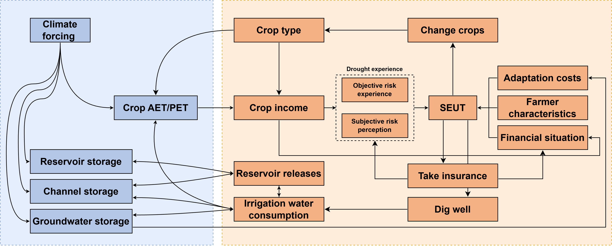

# Insurers

The `insurers` module represents agricultural insurance products used by crop farmers in GEB. It calculates insurance premiums and payouts from farmers' historical income and climate records, and estimates how insurance would change farmer income under drought.

The insurer does **not** decide whether a farmer buys insurance. Instead, it defines the financial consequences of the available insurance product and passes these to `crop_farmers`, where insurance is evaluated together with other adaptations using the Subjective Expected Utility Theory (SEUT) decision framework.

This creates an important behavioural feedback. Insurance can reduce income losses during drought, but the resulting change in financial risk can also alter the attractiveness of other adaptations such as groundwater wells or crop switching.

*Figure: Example of coupled feedbacks between climate and hydrology, crop production, drought experience, farmer characteristics and adaptation decisions in GEB. Source: Kalthof et al. (2026), [*Beyond profit: Modelling the socio-hydrological impacts of agricultural insurance and drought adaptation*](https://doi.org/10.1016/j.ijdrr.2026.106159).*

## Insurance products

The current implementation supports three drought-insurance products:

- **traditional insurance**, where compensation depends on realized farm income losses;
- **SPEI index insurance**, where payouts are triggered by a drought index;
- **precipitation index insurance**, where payouts are triggered by accumulated precipitation.

Only products enabled in the model configuration (model.yml) are evaluated.

Traditional and index insurance represent different ways of transferring drought risk. Traditional insurance follows the farmer's realized losses more closely, but requires information on agricultural outcomes. Index insurance instead uses an external climate indicator. This makes payouts independent of the farmer's actual loss, which can reduce moral hazard but introduces **basis risk**: the index may trigger when the farmer has little loss, or fail to trigger when the farmer experiences a large loss.

For an application of these insurance designs and their interaction with farmer adaptation, see [Kalthof et al. (2026)](https://doi.org/10.1016/j.ijdrr.2026.106159).

## Historical losses and insured income

Insurance calculations use the income histories maintained by `crop_farmers`. For each farmer and year, the module estimates a **potential insured loss** as the positive shortfall between the farmer's realized income and their historical average income.

These historical losses provide a common basis for pricing traditional insurance and for evaluating how well index-insurance contracts reproduce actual farm losses.

To evaluate insurance within the farmer decision framework, GEB also reconstructs what historical income would have been **with insurance**. Historical payouts are added to realized income and converted into an insured income or yield ratio relative to potential income. This produces an insured drought–income relationship that can be compared with the farmer's uninsured relationship in the SEUT calculation.

## Traditional insurance

Traditional insurance is modelled as an income-loss indemnity product. A payout occurs when realized income falls below a historical income threshold. In the current implementation, this threshold is based on a moving window of previous income, following the logic of the Indian PMFBY scheme used in the original GEB insurance application.

### Premiums

Traditional premiums use **Bühlmann–Straub credibility pricing**. This is useful because individual farmers may have short or highly variable loss histories.

The model first calculates each farmer's average historical insured loss. Farmers are then placed in comparable groups using the crop-farmer grouping system (see Crop farmers documentation). In the current implementation, the grouping combines the farmer base groups with well-irrigation status.

The premium combines:

- the farmer's own historical average loss; and
- the average loss of the farmer's group.

The **credibility weight** determines how much weight is placed on each. Farmers with more informative individual histories receive more weight on their own experience, while uncertain or volatile histories are pulled more strongly towards the group average.

A configurable loading factor is then added to represent costs above the expected payout, such as administration and claim handling.

### Payouts

For insured farmers, the model reconstructs historical indemnities by comparing realized income with the moving historical income threshold. Any positive shortfall is added to the farmer's insured income.

Because traditional insurance directly compensates realized income losses, it can change the drought–income relationship used when farmers evaluate other adaptations. This allows interactions between insurance, wells and crop choice to emerge within the coupled model rather than being imposed externally.

## Index insurance

Index insurance links payouts to an observable climate indicator instead of the farmer's realized loss. GEB currently supports both **SPEI-based** and **precipitation-based** index products. Their general contract structure is the same.

Each contract is described by three parameters:

- **strike**: the index value at which payouts begin;
- **exit**: the value at which the maximum payout is reached;
- **rate**: the maximum payout amount.

Between the strike and exit values, payouts increase linearly. No payout is made when conditions remain above the strike, while the full rate is paid once the exit threshold is reached or exceeded in the dry direction.

### Selecting index contracts

Rather than prescribing one contract for all farmers, GEB searches across candidate combinations of strike, exit and rate. The candidate ranges are estimated from historical climate conditions and income losses.

For each farmer, the model compares the payouts that candidate contracts would have generated with the farmer's historical losses. The contract with the lowest mismatch is selected. This explicitly aims to reduce **basis risk** by choosing an index contract whose historical payouts resemble the farmer's loss pattern as closely as possible.

The long-term expected payout is estimated from the fitted probability distribution of the insured climate index. A loading factor is then applied to obtain the premium.

For SPEI insurance, the model uses the drought-frequency information already available for crop farmers. For precipitation insurance, GEV parameters for precipitation extremes are sampled at each farmer's location during model initialization.

## Premium caps

GEB can optionally apply a government cap to the premium paid by farmers. The current implementation contains an India-specific premium cap based on the PMFBY-style application used in the Bhima basin case study.

Farmers are grouped using the crop-farmer grouping system and well status. The cap is expressed as a fraction of average group income per unit area and then scaled to the farmer's cultivated area. In the current implementation, sugarcane groups receive a higher cap than other crop groups.

This cap represents the maximum premium paid by the farmer. If the actuarially calculated premium is higher, the farmer-facing premium is limited to the cap.

## Interaction with farmer adaptation

Insurance and farmer adaptation are tightly coupled. The insurer module provides two main outputs to `crop_farmers`:

1. the **premium** the farmer would pay; and
2. the **insured drought–income relationship** describing expected income if the farmer had insurance.

`crop_farmers` then evaluates these values in the same SEUT framework used for wells, crop switching and irrigation adaptation. The farmer considers the reduction in drought losses against the premium and their other financial commitments.

Traditional and index insurance are treated differently where this is behaviourally important. Traditional insurance can modify the income–drought relationship used by already insured farmers when they evaluate subsequent adaptations. Index insurance remains linked to the external climate trigger, allowing the model to represent the different adaptation incentives associated with indemnity and index products.

Insurance can therefore affect more than the direct financial loss from drought. By changing income stability and the farmer's financial situation, it can indirectly change subsequent adaptation choices and, through those choices, crop production and water use.

## Annual model cycle

Insurance is mainly evaluated on the same annual timescale as long-term farmer adaptation:

1. **During the year:** crop production, drought conditions and farmer income are simulated.
2. **At the hydrological-year boundary:** historical income and climate records are updated.
3. **Insurance pricing:** potential losses, premiums and insured income histories are calculated for the active insurance product.
4. **Farmer decision:** `crop_farmers` compares the expected utility of insurance with remaining uninsured.
5. **Following years:** payouts affect insured income when the relevant loss or index trigger occurs.

Historical insured income is shifted each year so that insurance pricing and farmer decisions continue to use an evolving record rather than a fixed baseline.

## Computational design

Insurance pricing can require evaluating many farmers, historical years and possible index contracts. The implementation therefore relies mainly on numerical arrays shared with `crop_farmers`.

The search over candidate index contracts is one of the more computationally intensive parts of the module. This calculation is implemented with Numba-optimized routines so that many combinations of strike, exit and payout rate can be evaluated efficiently for large farmer populations.

The insurer module also reuses the farmer grouping and drought-history infrastructure from `crop_farmers`. This avoids duplicating farmer state and keeps insurance directly connected to the agricultural and behavioural parts of the model.

## Interaction with other GEB modules

`insurers` mainly interacts with:

- **crop farmers**, which provide historical income, potential income, drought and precipitation histories, crop rotations, well status and insurance uptake;
- the **decision module**, through `crop_farmers`, which determines whether insurance is preferred over remaining uninsured;
- the **hydrological and climate data**, which provide the SPEI and precipitation histories used by index products.

The insurer module translates these physical and economic histories into premiums and payouts. Farmer agents then translate those insurance conditions into behavioural decisions.

## References

Kalthof, M. W. M. L., di Baldassarre, G., Aerts, J. C. J. H., de Moel, H., & de Bruijn, J. (2026). Beyond profit: Modelling the socio-hydrological impacts of agricultural insurance and drought adaptation. *International Journal of Disaster Risk Reduction, 141*, 106159. [https://doi.org/10.1016/j.ijdrr.2026.106159](https://doi.org/10.1016/j.ijdrr.2026.106159)

## Code

::: geb.agents.insurers
