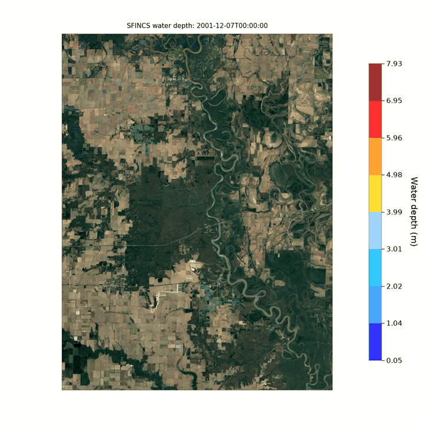

# Flood evaluation

Evaluate simulated flood extents by comparing them with satellite observations or other flood mapping data.

## Overview
The hydrodynamics evaluation tools help you:

- Compare simulated vs observed flood extents
- Calculate spatial performance metrics (Hit Rate, False Alarm Ratio, CSI)
- Visualize flood extent accuracy 
- Analyze model performance across different flood events
- Generate diagnostic plots for each event and forecast initialization

## Basic usage
Evaluate flood extents against observations:

```bash
geb evaluate hydrodynamics.evaluate_hydrodynamics --run-name default
```

## Observation dataset
Simulated flood extents are by default compared with the WorldFloods v2 database [@portales2023global], which is a global collection of flood extent maps derived from Sentinel-2 optical satellite imagery. When building a model, `setup_flood_observations` selects the events in WorldFloods that overlap with the model region and stores their flood masks in the model input. These can then be referenced under `hazards.floods.observation_files` (see [required input data](#required-input-data)). Other flood mapping data can be used as well, as long as it is saved as a zarr file named after the event. It is recommended to use lidar based flood extent maps.

## Parameters

| Parameter | Description | Default |
| --- | --- | --- |
| `run_name` | Name of the simulation run to evaluate | `"default"` |

## What it does
The evaluation process:

- Reads all flood events from your model config file
- Loads observed flood extents from the config file. The file should have the same name as your flood event and be saved as a zarr (i.e. start time - end time.zarr)
- Loads corresponding simulated flood maps from model output
- Resamples observations to match model resolution if needed
- Calculates performance metrics for each event
- Creates visualizations comparing observed vs simulated extents
- Saves all results to structured output folders

## Performance metrics
Three spatial metrics are calculated for each flood map:

**Hit Rate (HR)**: Percentage of observed flooded pixels correctly predicted (0 to 1, perfect = 1)

$$\text{Hit Rate} = \frac{\text{Hits}}{\text{Hits} + \text{Misses}}$$

**False Alarm Ratio (FAR)**: Percentage of predicted floods that did not occur (0 to 1, perfect = 0)

$$\text{FAR} = \frac{\text{False Alarms}}{\text{False Alarms} + \text{Hits}}$$

**Critical Success Index (CSI)**: Overall accuracy accounting for hits, misses, and false alarms (0 to 1, perfect = 1)

$$\text{CSI} = \frac{\text{Hits}}{\text{Hits} + \text{False Alarms} + \text{Misses}}$$

## Outputs
Results are saved to output/evaluate/hydrodynamics/{event_name}/

For each event two files are generated:

- **start time - end time_performance_metrics.txt**: gives an overview of Hit Rate, False Alarm Ratio, Critical Success Index, number of flooded pixels and flooded area
- **start time - end time_validation_floodextent_plot.png**: figure plotting the hits (green), false alarms (orange) and misses (red), together with the catchment outline and OSM map

## Flood animation
Besides the static extent comparison, GEB can render the flooding over time as a video, this is just to visually examine and can also be used to show how the flood develops over time in a catchment:

```bash
geb evaluate hydrodynamics.animate_flood --run-name default
```

By default GEB does not store intermediate flood maps. To make a video this setting needs to be enabled, set the output interval in your floods model config and re-run the model first (e.g. every hour):

```yaml
hazards:
  floods:
    flood_map_output_interval_seconds: 3600
```

One animation is created per SFINCS model and event, and written to output/evaluate/hydrodynamics/{event_name}/. The main options are:

| Parameter | Description | Default |
| --- | --- | --- |
| `run_name` | Name of the simulation run to animate | `"default"` |
| `event` | Only animate events whose name contains this string | all events |
| `step` | Animate every n-th time step | `1` |
| `fps` | Frames per second | `5` |
| `dpi` | Resolution of the video frames | `100` |
| `background` | Background map: `"sat"` (satellite), `"osm"` or `"none"` | `"sat"` |
| `zoom` | Zoom level of the background map tiles | `12` |
| `fmt` | Output format, `"mp4"` or `"gif"`. If not set, MP4 is used when ffmpeg is available and GIF otherwise | `None` |
| `vmax` | Upper limit of the color scale (m). Set explicitly to compare runs on the same scale | 98th percentile of wet-cell depth |

<figure markdown="span">
  
  <figcaption>Example flood depth animation created with `geb evaluate hydrodynamics.animate_flood` (hourly output, satellite background).</figcaption>
</figure>

## Required input data
For hydrodynamics evaluation, your model must have:

   1. **Flood event configuration** in your model config file with path to observation file(s) (see example below):

   ```yaml
   hazards:
     floods:
       events:
         - start_time: "2021-07-12 09:00:00"
           end_time: "2021-07-20 09:00:00"
       observation_files:
         - "path/to/20210712T090000 - 20210720T090000.zarr"
   ```
  2. **Simulated flood maps** located in output/evaluate/hydrodynamics/{event_name}/

## Interpreting results 
A CSI above 0.7 is considered good model performance [@bernhofen2018first]


