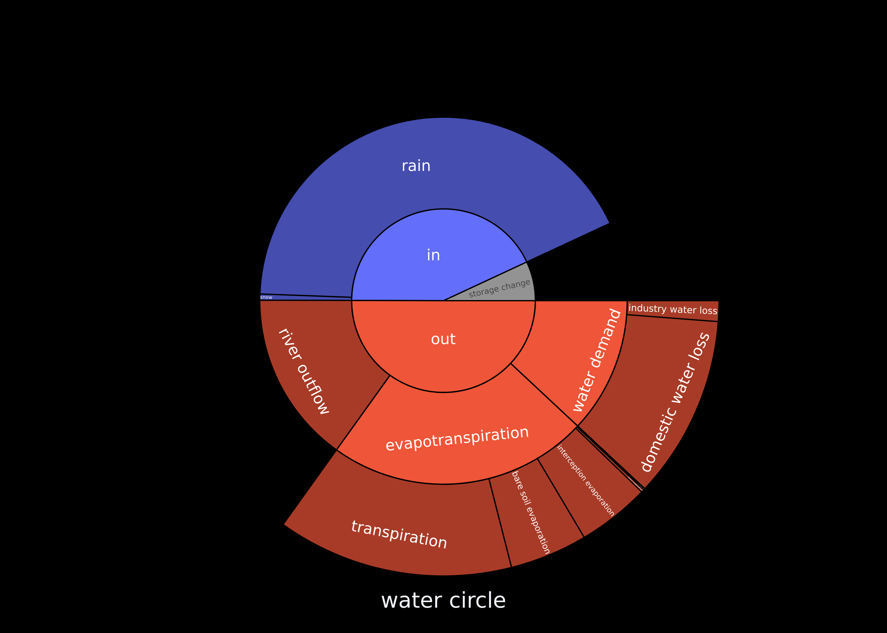

# Report

The report module provides functionality for to report model data to disk. This can be configured in `model.yml` under the `report` key. The structure is as follows:

``` yaml
report:
    module_name:
        filename:
            varname: varname
            type: type
            function: function
            frequency: frequency  # optional
        other_filename:
            varname: varname
            type: type
            function: function
            frequency: frequency  # optional
    other_module_name:
        filename:
            varname: varname
            type: type
            function: function
            frequency: frequency  # optional
```

For example, to export the total bare soil evaporation, gridded daily discharge, and the mean channel abstraction by crop_farmers, you would use the following configuration:

``` yaml
report:
    hydrology.soil:
        actual_bare_soil_evaporation_weighted_sum:
            varname: .actual_bare_soil_evaporation
            type: HRU
            function: weightednanmean
    hydrology.routing:
        discharge_daily:
            varname: grid.var.discharge_m3_s
            type: grid
            function: null
    agents.crop_farmers:
        channel_abstraction_m3_by_farmer_mean:
            varname: var.channel_abstraction_m3_by_farmer
            type: agents
            function: mean
    hydrology:
        storage:
            varname: .current_storage
            type: scalar
```

The following options are supported.

- **module_name**: The name of the module in the GEB model. Both agents and hydrological modules are supported. Please refer to the name property of the module for the correct names.
- **filename**: The name of the file to be created. This can be a .csv or .zarr file. If the file already exists, it will be overwritten. The filename will be created in the output directory specified in the model configuration file, and placed inside the subdirectory with the name of the module.
- **varname**: The name of the variable to be reported. NumPy-style fancy indexing is supported. For example `varname[:,0]` selects the first column of a 2D array. There are two options:
  - **module attribute**: The variable name in the module. Any variable that can be reached from "self" in the module can be used. For example, `[self.]varname` or `[self.]grid.var.discharge_m3_s`. Note that `self.` is ommited.
  - **local variable**: Any variable that exists within the `step` function of the module. This is useful for reporting variables that are not stored between timesteps. Local variables are prefixed with ".", for exampe `.actual_bare_soil_evaporation` in the example above.
- **type**: The type of the variable. This can be one of the following:
  - **scalar**: A scalar variable that is reported as a single value.
  - **grid**: A variable that is stored in the grid structure of GEB.
  - **HRU**: A variable that is stored in the hydrological response unit (HRU) structure of GEB.
  - **agents**: A variable that is stored in the agents. This is a 1D array with the same length as the number of agents. The variable will be reported as a 1D array.
- **function**: The function to be used to process the variable before reporting. The supported options vary per type. Each type supports the **null** function, which means that no function is applied and the variable is reported as is in a zarr file. In all other cases the variable is reported at the end of the model run in a csv file. The following functions are supported:
  - **scalar**: No functions are applied to scalar variables. Reporting is done as a single value in a csv file (per timestep).
  - **agents**:
    - **null**: No function is applied. The variable is reported as is.
    - **mean**: The mean of the variable is calculated and reported.
    - **nanmean**: The mean of the variable is calculated and reported, ignoring NaN values.
    - **sum**: The sum of the variable is calculated and reported.
    - **nansum**: The sum of the variable is calculated and reported, ignoring NaN values.
  - **grid** and **HRU**:
    - **null**: No function is applied. The variable is reported as is.
    - **mean**: The mean of the variable is calculated and reported.
    - **nanmean**: The mean of the variable is calculated and reported, ignoring NaN values.
    - **sum**: The sum of the variable is calculated and reported.
    - **nansum**: The sum of the variable is calculated and reported, ignoring NaN values.
    - **weightedmean**: The mean of the variable is calculated and reported, weighted by the grid cell area.
    - **weightednanmean**: The mean of the variable is calculated and reported, weighted by the grid cell area, ignoring NaN values.
    - **weightedsum**: The sum of the variable is calculated and reported, weighted by the grid cell area. This means that the variable is multiplied by the grid cell area before summing. This is (for example) useful for variables that are reported in meters, and are now converted to cubic meters.
    - **weightednansum**: The sum of the variable is calculated and reported, weighted by the grid cell area, ignoring NaN values. This means that the variable is multiplied by the grid cell area before summing, ignoring NaN values.
    - **sample_xy,[x],[y]**: Sample a specific variable at specific x,y pixel. 0,0 is the top left corner of the grid. Example is **sample_xy,1,2** to sample the variable at pixel 1,2.
    - **sample_lonlat,[lon],[lat]**: Sample a specific variable at specific coordinates using the lon,lat coordinates of the grid. The coordinates are in the same coordinate system as the grid. Example is **sample_coord,4.89,52.38** to sample the variable at coordinates latitude 52.38 and longitude 4.89 (Amsterdam). Note that when reporting discharge, it is important to make sure that the location is in the actual river you want to sample from. You can refer to the upstream area in the input files to find the actual river.
- **frequency** (optional): The frequency at which the variable is reported. The default is **every: day** This can be one of the following:
  - **initial**: The variable is reported at the initial time step only.
  - **final**: The variable is reported at the final time step only.
  - **every**: The variable is reported at specified timesteps, examples are given below.

Report the data every third day of the month:

``` yaml
report:
    module_name:
        filename: filename
        varname: varname
        type: type
        function: function
        frequency:
            every: month
            day: 3
```

### Water circles

Water circles are used to report the inflow and outflow of water in the system. These can be generated by `geb evaluate --methods water_circle`, but require special variables to be reported during the run.



For more information about water circles, see: [10.1088/1748-9326/ad18de](https://doi.org/10.1088/1748-9326/ad18de)

To turn on this option, configure the following in the `model.yml` file:

``` yaml
report:
    _water_circle: true
```

## Code

::: geb.reporter
