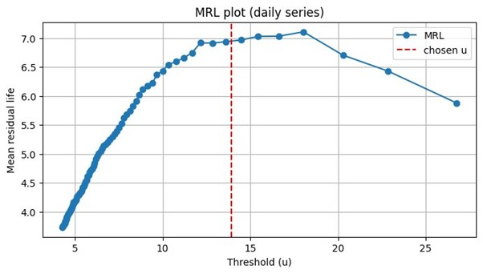

# Extreme Value Analysis

Extreme value analysis (EVA) is used in GEB to estimate the magnitude of extreme value events (like floods and windstorms) for different return periods. For example, "What discharge level would we expect once every 100 years?"

## Overview

GEB uses the **Generalized Pareto Distribution Peaks-Over-Threshold (GPD-POT)** method to estimate return periods for river discharge. This method is particularly good at modeling the tail behavior of extreme value events.

## How It Works

### Step 1: Prepare the Data

We start with a time series of discharge data (e.g., hourly outputs from GEB hydrological module). The time series is converted to **daily maximum values** to remove temporal correlation and focus on extreme events.

### Step 2: Select a Threshold (Automated selection)

The GPD-POT method only looks at values that exceed a certain threshold. To pick a certain threshold is usually very important as we slice the input data and only look at values above that threshold:

- **Too low**: Violates the assumption that only extreme values follow the GPD
- **Too high**: Too few data points to fit the distribution reliably

Currently there is an automatic scan method which looks across multiple threshold candidates (from the 80th to 99th percentile of daily maxima) and selects the best one using statistical tests. For detailed descrition of the underlying method we refer to Solari et., al 2017 (https://doi.org/10.1002/2016WR019426). In Brief, a test called "Anderson-Darling test (AD)" is performed and p-values (significance level) is calculated for different thresholds. The highest p-value is chosen and thus the best threshold, the AD test checks the right tail as in "GPD" in which more weight is given to the data in the tails than to the data in the central part of the distribution.

### Step 3: Fit the GPD Distribution

For values exceeding the threshold (called "exceedances"), the GPD distribution is fitted using two parameters:

- **sigma (σ)**: Scale parameter - controls the spread of the distribution
- **xi (ξ)**: Shape parameter - controls the tail behavior:
    - ξ > 0: Heavy tail (more extreme events)
    - ξ = 0: Exponential tail (medium extremes)
    - ξ < 0: Short tail (bounded/fixed extremes)

### Step 4: Diagnostics and Figures

GEB uses multiple diagnostic tools to evaluate the quality of the GPD fit and to select the optimal threshold. The threshold with the **highest Anderson-Darling p-value** (best fit) is selected automatically.

#### Anderson-Darling (AD) Test with Bootstrap

The primary goodness-of-fit test used for threshold selection. The AD test is specifically weighted to emphasize the tail behavior, making it ideal for extreme value analysis.

- **Bootstrap**: Parametric bootstrap (default: 2000 samples) is used to calculate a robust p-value
-
#### Mean Residual Life (MRL) Plot

The MRL plot is a key diagnostic for threshold selection in GPD-POT analysis. It shows the mean excess value over each threshold.

- **What it shows**: For each threshold u, it plots the average of (X - u) for all values X > u
- **Expected behavior**: For a GPD, the MRL plot should be approximately linear above the optimal threshold
- **How GEB uses it**: GEB fits a linear baseline to the upper quantiles (top 25% by default) of the MRL plot and measures deviations from linearity as a diagnostic metric

A threshold that is:
- **Too low**: Shows systematic curvature away from linearity
- **Optimal**: Shows approximately linear relationship
- **Too high**: Has high variance due to few exceedances

<figure markdown="span">
  
  <figcaption>Example MRL plot showing threshold selection diagnostics.</figcaption>
</figure>

#### Additional Diagnostics

The analysis also computes:

- **Number of exceedances**: Tracks n_exc for each threshold to ensure adequate sample size. By default minimum 30 exceedances are required to fit the statistical model. This minimum numeric value ensures that the statistical model has a good fit. 

#### Diagnostic values Output

For each threshold scanned, the following diagnostics are recorded:

- `u`: Threshold value
- `sigma`, `xi`: Fitted GPD parameters
- `n_exc`: Number of exceedances
- `p_ad`: Anderson-Darling p-value (used for selection)
- `mrl_err`: Deviation from linear MRL baseline
- `A_R2`: Right-tail Anderson-Darling statistic
- `xi_step`: Change in shape parameter from previous threshold


### Step 5: Calculate Return Levels

Once the best threshold and GPD parameters are determined, return levels for specific return periods (e.g., 10-year, 100-year, 1000-year events) are calculated using:

For ξ ≈ 0:
```
Q_T = u + σ × ln(λ × T)
```

For ξ ≠ 0:
```
Q_T = u + (σ/ξ) × [(λ × T)^ξ - 1]
```

Where:

- `Q_T`: Return level for return period T
- `u`: Threshold value
- `σ`: Scale parameter
- `ξ`: Shape parameter
- `λ`: Average number of exceedances per year
- `T`: Return period in years

## Configuration

Return periods can be configured in the GEB configuration file:

```yaml
hazards:
  floods:
    return_periods: [2, 5, 10, 25, 50, 100, 250, 500, 1000]
```

## Advanced Parameters

The GPD-POT analysis has several tunable parameters (defaults are typically appropriate):

- **quantile_start** (default: 0.80): Starting quantile for threshold scan
- **quantile_end** (default: 0.99): Ending quantile for threshold scan
- **quantile_step** (default: 0.01): Step size between quantiles
- **min_exceed** (default: 30): Minimum number of exceedances required for reliable fitting
- **nboot** (default: 2000): Number of bootstrap samples for p-value calculation

## Implementation Details

The GPD-POT analysis is implemented in two main functions:

1. **`gpd_pot_ad_auto`**: Performs the automated threshold selection and GPD fitting
2. **`assign_return_periods`**: Applies the analysis to multiple rivers and creates hydrographs

Key helper functions:

- **`fit_gpd_mle`**: Fits GPD using Maximum Likelihood Estimation
- **`bootstrap_pvalue_for_ad`**: Calculates bootstrap p-values for goodness-of-fit
- **`mean_residual_life`**: Diagnostic tool for threshold selection
- **`gpd_return_level`**: Calculates return levels from fitted parameters

## When It's Used

The GPD-POT analysis is automatically triggered when running:

```python
model.estimate_return_periods()
```

This method:

1. Extracts discharge time series for all river segments
2. Applies GPD-POT analysis to estimate return levels
3. Creates synthetic hydrographs for each return period
4. Runs SFINCS flood simulations for each return period
5. Generates flood maps for the specified return periods

## Output

The analysis produces:

- **Return level estimates** for each river segment (stored in river attributes as `Q_2`, `Q_10`, `Q_100`, etc.)
- **Diagnostic information** including:
    - Selected threshold value
    - Fitted GPD parameters (σ, ξ)
    - Anderson-Darling p-value
    - Number of exceedances
    - Percentile of the threshold
- **Hydrographs** for each return period with rising and recession limbs

## Limitations and Assumptions

1. **Data Requirements**: Needs at least 30 exceedances above the threshold for reliable results. Longer time series produce more reliable estimates.

2. **Independence**: Assumes daily maxima are approximately independent. If the underlying data has strong temporal correlation, consider using declustering methods.

3. **Stationarity**: Assumes the statistical properties of extremes don't change over time. Climate change and land use changes can violate this assumption.

4. **Extrapolation**: Estimates for very long return periods (e.g., 10,000 years) extrapolate far beyond the observed data and carry large uncertainty.

5. **Spatial Consistency**: Each river segment is analyzed independently. Adjacent segments may have inconsistent return level estimates.

## Diagnostic Checks

The method includes several automatic safeguards:

- **Zero discharge**: If all discharge values are near zero, return levels are set to zero
- **Extreme values**: Return levels exceeding 400,000 m³/s (example amazon river has this discharge) are capped with a warning

## References

The implementation is based on standard extreme value theory:

- Solari, S., Egüen, M., Polo, M. J., & Losada, M. A. (2017). Peaks Over Threshold (POT): A methodology for automatic threshold estimation using goodness of fit p-value. *Water Resources Research*, 53(4), 2833-2849. https://doi.org/10.1002/2016WR019426

## Future Enhancements

Diagnostic plotting capabilities (including MRL plots, parameter stability plots, Q-Q plots, and k-test) are planned for future releases when `diagnostic_plotting` is enabled in the configuration. Additional goodness-of-fit tests and the method of L-moments may be incorporated following recommendations from Solari et al. (2017).
