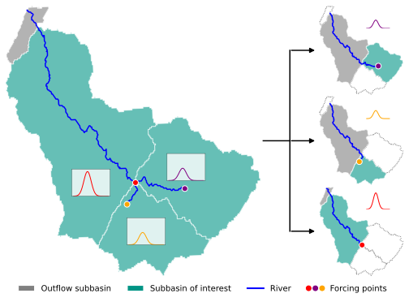
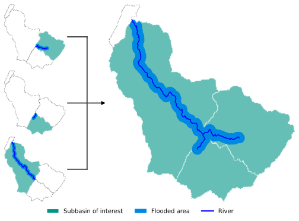

# Floods

## Introduction

Lorem ipsum

## Model building

Lorem ipsum

### Static input data

Lorem ipsum

### (Dynamic) forcing data

Lorem ipsum

#### Riverine forcing

Lorem ipsum

#### Precipitation Forcing

Lorem ipsum

#### Coastal forcing

Lorem ipsum

### Rebuilding

We distinguish two parts of a SFINCS model: the static data and dynamic data:

- The static data created in the [`SFINCS root model`][geb.hazards.floods.sfincs.SFINCSRootModel] is saved in the root model and often identical between SFINCS runs. For example, when there are two flood events, the DEM usually remains stable. Since building a SFINCS model can take quite some time dependent on the size and configuration (primarily the grid size), the static data can be re-used between runs. In the model [configuration](../getting_started/configuration.md) `hazards.floods.overwrite` you can find the setting for floods:

    - `auto`: automatically detect whether the model must be overwritten. If there are any changes in the data that is provided to the [`SFINCS root model`][geb.hazards.floods.sfincs.SFINCSRootModel] or there are any changes in the code in `geb.hazards.floods`, the model is overwritten. Otherwise, the existing model is used if it exists.
    - `true`: the model is always overwritten
    - `false`: the model is always read, unless it doesn't exist yet

- The dynamic data (e.g., forcing data) created in the [`SFINCS simulation`][geb.hazards.floods.sfincs.SFINCSSimulation] is different for each SFINCS simulation (and usually much smaller) and never saved between SFINCS runs.

## Model runs

Lorem ipsum

### Flood events

Lorem ipsum

### Return period maps

To generate return period flood maps (e.g., for a 1-in-100 year event), GEB simulates each subbasin individually.

#### The Paired Basin Approach

For each subbasin in the routing network, GEB constructs a SFINCS model domain that consists of the "subbasin of interest" and its immediate "downstream subbasin". This pairing ensures that:
1.  Flood waves travelling from the focus subbasin are properly routed through its downstream neighbor.
2.  Backwater effects or downstream water level constraints are better represented than if the model stopped exactly at a subbasin boundary.

#### Forcing and Simulation

The return period mapping process follows these steps:
1.  **Discharge Estimation**: GEB uses discharge time series from a long-term spinup or routing simulation to estimate peak flows for specific return periods (e.g., 10, 50, 100 years).
2.  **Hydrograph Generation**: For each subbasin of interest, a design hydrograph is generated for the estimated return period peak.
3.  **Boundary Conditions**: These hydrographs are applied as discharge forcing at the "inflow nodes" (upstream points) of the focused subbasin.
4.  **Local Hydrodynamic Modeling**: A separate SFINCS simulation is executed for each pairing.
5.  **Mosaicking**: The maximum flood depth maps from all individual simulations are then combined into a single, consistent flood visibility map for the entire region.

## Model output

SFINCS flood simulations produce both static outputs and time-varying dynamic outputs.

Common outputs include:

- **Maximum flood depth map**  
  Stored as `.zarr` file representing the maximum water depth over the entire simulation time period.

- **Time-varying dynamic output**  
  Stored as NetCDF (`.nc`) file containing water level, velocity, and other variables at each timestep.

- **Auxiliary outputs**  
  Depending on configuration, additional outputs such as figures for diagnostics may be produced.

## Performance metrics

Metrics may include:
- Comparison against observed flood extents
- Event-based skill scores (binary class statistics)

## Code

::: geb.hazards.floods.sfincs
