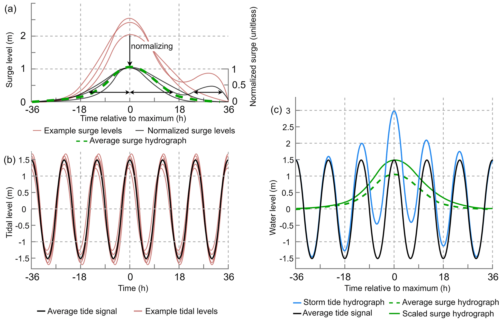
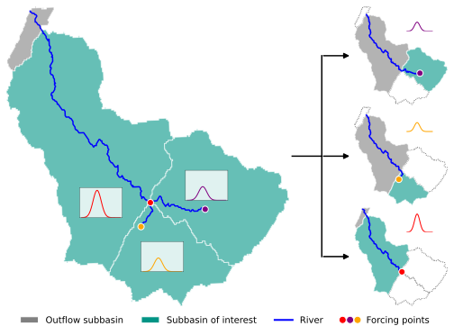
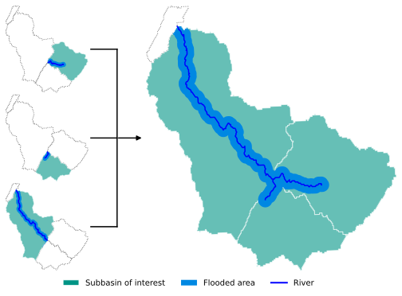
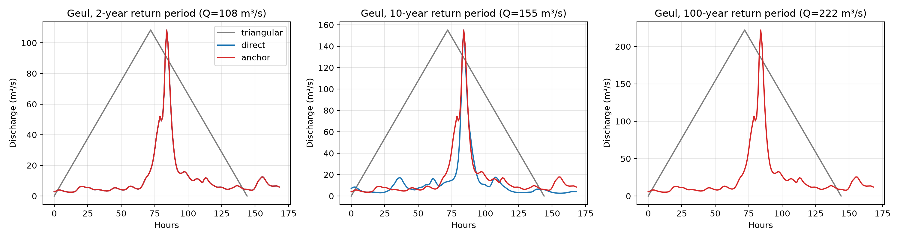
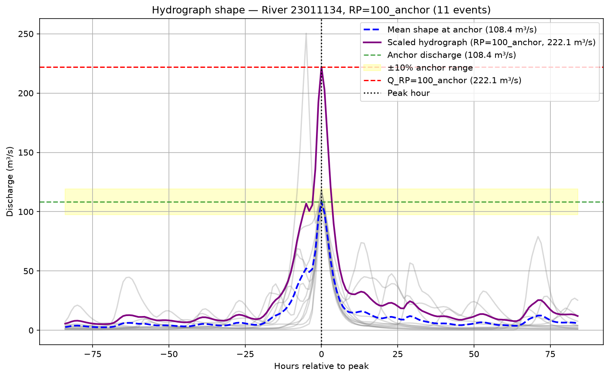
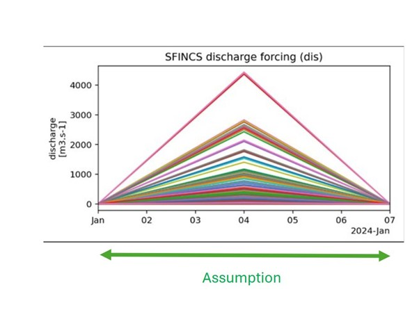

# Floods

## Introduction

The floods module in GEB uses the Super-Fast INundation of CoastS (SFINCS) hydrodynamic model to simulate floods. SFINCS is a fully automated, 2D reduced-complexity hydrodynamic model that solves simplified Saint-Venant equations of mass and momentum (Leijnse et al., 2021). It balances computational speed with physical realism, making it practical to simulate many flood scenarios across large regions. For detailed description of the model equations we refer to https://sfincs.readthedocs.io/en/latest/.

SFINCS works by dividing the area of interest into a grid of cells. For each cell, it calculates water depth and flow at successive time steps based on the elevation (topography), surface roughness (manning's), and incoming water (forcing) from rain (precipitation), rivers (discharge), or the coast (surge and storm tide).

Multiple flood types can be simulated in GEB:

- **Fluvial (riverine)**: Flooding from river overflow when discharge exceeds river channel capacity
- **Coastal**: Inundation from elevated sea levels due to storm surge and tides
- **Return period**: Probability flood maps showing expected flooding for specific return periods (e.g., 1-in-100 year event)

## Model building

The SFINCS model in GEB is built in two stages: creating the base model structure (required input maps) and then adding forcing data for specific flood events.

When building a SFINCS model, GEB first creates a region of interest (eg., catchment boundary). This region by default is divided into grid cells (regular grid), with each cell storing information about elevation, land roughness properties, etc. The model can optionally use "subgrid", which captures fine-scale elevation details within each cell. This allows for faster simulations while still representing important features like small river channels.

Rivers are represented in the model in one of two ways:

- **With subgrid**: River channels are "burned" into a high-resolution subgrid, preserving their width and depth.
- **Without subgrid**: Rivers are directly carved into the main computational grid, modifying the elevation and roughness values of affected cells.

The model automatically identifies flood-prone areas inside the region using Height Above Nearest Drainage (HAND) analysis [@nobre2016hand]. This method calculates how high each location sits above the nearest stream or drainage channel, helping to define which areas are prione to flooding.

### Static input data

The static components of a SFINCS model remain constant across different flood simulations and include:

- **Digital Elevation Model (DEM)**: Multiple DEMs from different sources can be merged, with priority given to user defined 1st and subsequent source. For example in a riverine flood, the priority by default is given to inland elevation (FABDEM V1-2) and then if needed sometimes the outflows reach a part where topobathy is needed (2nd source: GEBCO version ?) 
- **Manning's roughness coefficient**: Represents surface friction that slows down water flow. Different land cover types (forests, urban developed areas, cropland etc.,) have different roughness values. By default the ESA Landcover 2021 is used.
- **Model domain (mask)**: Defines which grid cells are active in the simulation. This is determined based on the subbasins being modeled (delineated via the hydrological part) and made faster using the aforementioned HAND method.
- **River network**: By default, the geometry (centerlines) uses the global MERIT-BASINS product based on the 90 m MERIT-HYDRO DEM. River width and depth are estimated by the hydrological model's routing module (`geb.hydrology.routing`).

### (Dynamic) forcing data

Dynamic forcing data varies between flood types and drives the actual inundation simulation. GEB supports multiple forcing methods that can be combined depending on the type of flood.

#### Riverine forcing

Riverine (fluvial) forcing represents water entering the model domain through rivers and streams. GEB provides two approaches:

- **Accumulated Runoff forcing**: The term "accumulated" refers to the fact that all rainfall-runoff from the upstream catchment area has been collected and concentrated at these locations.
- **All inflow point forcing**: Discharge is applied at multiple start points (headwater points) throughout the river network, including tributaries.

Discharge values comes from GEB hydrological module, which simulates rainfall-runoff processes across the region. For return period mapping, synthetic design hydrographs are generated based on extreme value analysis of long-term discharge records.

#### Coastal forcing

For coastal flood simulations, water level boundary conditions are applied along the coastline. These represent sea level variations due to tides and storm surges. To create storm surge hydrographs we follow the HGRAPHER method as outlined by Dullaart et al.[@dullaart2023enabling]. To generate a hydrograph of the surge, this approach starts with extracting independent extremes from the GTSM[@muis2020high] surge time series based on the peaks-over-threshold (POT) method. For each selected surge event, the time series from 36 h before, until 36 h after the peak is extracted. Second, each 72 h surge event is normalized (i.e. dividing each surge level by the peak) such that the maximum surge value is equal to 1 (unitless). Third, the selected surge events are combined to calculate the average surge hydrograph. This is done by determining the time (relative to the peak) at which a specific surge height (from 0 to 1 with increments of 0.01) is exceeded. We recombine with the average and spring tide. As an example, the figure below shows that for one surge event the exceedance time at a normalized surge height of 0.25 is 14.0 h before and 26.0 h (16.0 + 10.0) after the surge maximum occurred, as indicated by the black arrows. Then, for each normalized surge height the average exceedance time is computed, resulting in an average curve. Because the shape of the rising and falling limb of the surge can differ, the exceedance time is calculated separately for each, and they are subsequently merged into the final average surge hydrograph.

<figure markdown="span">
  
  <figcaption>Overview of the HGRAPHER method pipeline. Figure reproduced from Dullaart et al..</figcaption>
</figure>

The storm tide hydrograph construction follows the HGRAPHER/COAST-RP workflow implemented in GEB:
- Tide and surge are separated from GTSM water level time series, and representative tidal signals are derived for both average tide and spring tide.
- Independent surge events are extracted with a POT approach, using a 36 h window before and after each peak.
- Each surge event is normalized by its peak, and exceedance times for normalized surge heights are averaged to obtain a mean surge hydrograph.
- For each return period, the surge hydrograph is scaled to the return-period water level and combined with the average or spring tide signal to produce a storm tide hydrograph. By default, the spring tide is used. 

We identify coastal boundary cells based on topography and proximity to the ocean, then apply water level boundary conditions at those cells. For return period coastal events, GEB builds a storm tide hydrograph per coastal station and writes these time series to disk, after which the SFINCS simulation reads the relevant file and applies the forcing at the station locations.


When running a coastal return period simulation, the model reads the precomputed hydrograph file (e.g., `gtsm_spring_tide_hydrograph_rp0100.csv`), aligns the station IDs with forcing locations, trims the leading and trailing timesteps, and optionally applies a sea level rise adjustment for a target year. The resulting time series are then set as coastal water level forcing with an offshore buffer so that boundary conditions are imposed outside the modeled land area.


### Rebuilding

We distinguish two parts of a SFINCS model: the static data and dynamic data:

- The static data created in the [`SFINCS root model`][geb.hazards.floods.sfincs.SFINCSRootModel] is saved in the root model and often identical between SFINCS runs. For example, when there are two flood events, the DEM usually remains stable. Since building a SFINCS model can take quite some time dependent on the size and configuration (primarily the grid size), the static data can be re-used between runs. In the model [configuration](../getting_started/configuration.md) `hazards.floods.overwrite` you can find the setting for floods:

    - `auto`: automatically detect whether the model must be overwritten. If there are any changes in the data that is provided to the [`SFINCS root model`][geb.hazards.floods.sfincs.SFINCSRootModel] or there are any changes in the code in `geb.hazards.floods`, the model is overwritten. Otherwise, the existing model is used if it exists.
    - `true`: the model is always overwritten
    - `false`: the model is always read, unless it doesn't exist yet

- The dynamic data (e.g., forcing data) created in the [`SFINCS simulation`][geb.hazards.floods.sfincs.SFINCSSimulation] is different for each SFINCS simulation (and usually much smaller) and never saved between SFINCS runs.

## Model runs

Once the SFINCS model is built and forcing data is prepared, the simulation is executed to calculate how water moves and accumulates across the region domain. The model solves equations of water moving, tracking water depth at each time step, flow velocity, and direction throughout the domain.

Simulations can run on either CPU (default) or GPU (optional) hardware. GPU execution provides significant speed improvements (caution: GPU is untested at larger scales and can have instabilities) for large model domains, making it practical to simulate many flood scenarios or long time periods.

The model includes a spinup period (typically 24 hours) before the main simulation begins. During spinup, the model reaches a balanced initial state, ensuring that results are not affected by artificial conditions (too extreme amounts of water entering) at the start of the simulation.

### Basin selection for a model run
Flood simulations for basins can be executed in various ways. The following settings determine the selection of basins in a flood simulation:
```yaml
hazards:
  floods:
    simulate: true
    subbasins: auto
```
Description:
- **`auto`** (default): Simulates subbasins whose discharge exceeds the bankfull threshold during the event, along with their downstream subbasins.
- **`all`**: Simulates all subbasins.
- **List of COMID values**: Simulates only the listed subbasins (for example, `[23011134, 23011135]`).
### Flood events

Flood event simulations model specific historical or synthetic flood scenarios over a defined time period (e.g., a major storm lasting several days). These simulations use time-varying forcing data:

- Rivers discharge varies according to the hydrograph for that event
- Coastal water levels vary following observed or modeled sea level conditions

#### Detecting historical flood events 

GEB also supports automatic detection of historical flood events. If the discharge at a certain location exceeds a certain threshold, the historical flood will be automatically simulated using SFINCS. The user does not need to manually provide start and end times of the flood. For this to work, enable flood simulation and set the following parameters in the config file:

```yaml
hazards:
  floods:
    simulate: true
    detect_floods_from_discharge: true
    discharge_threshold: 30  # discharge threshold in m3/s for flood detection
    threshold_location: [0.0, 0.0]  # [lon, lat] of the location where the discharge threshold is applied; replace with a location in your model domain.
```


### Return period maps

To generate return period flood maps (e.g., for a 1-in-100 year event), GEB simulates each subbasin individually.

#### The Paired Basin Approach

For each subbasin in the routing network, GEB constructs a SFINCS model domain that consists of the "subbasin of interest" and its immediate "downstream subbasin". This pairing ensures that:

1.  Flood waves travelling from the focus subbasin are properly routed through its downstream neighbor.
2.  Backwater effects or downstream water level constraints are better represented than if the model stopped exactly at a subbasin boundary.

<figure markdown="span">
  
  <figcaption>**The paired subbasin approach.** For each segment, the local SFINCS model includes the focus subbasin and its immediate downstream neighbor. Design hydrographs are applied as discharge forcing at inflow nodes.</figcaption>
</figure>

#### Forcing and Simulation

The return period mapping process follows these steps:

1.  **Discharge Estimation**: GEB uses discharge time series from a long-term spinup or routing simulation to estimate peak flows for specific return periods (e.g., 10, 50, 100 years). It is recommended to use atleast 40 years of discharge (either "spinup" or "run"), and by default the estimation uses a joined time series of both "spinup" + "run" discharge.
2.  **Hydrograph Generation**: For each subbasin of interest, a design hydrograph is generated for the estimated return period peak. The shape of this hydrograph can be selected by the user, see [Hydrograph shape](#hydrograph-shape).
3.  **Boundary Conditions**: These hydrographs are applied as discharge forcing at the "inflow nodes" (upstream points) of the focused subbasin.
4.  **Local Hydrodynamic Modeling**: A separate SFINCS simulation is executed for each pairing.
5.  **Mosaicking**: The maximum flood depth maps from all individual simulations are then combined into a single, consistent flood visibility map for the entire region.

<figure markdown="span">
  
  <figcaption>**Flood map mosaicking.** Individual localized flood depth maps are merged into a continuous mosaicked output.</figcaption>
</figure>

## Model output

SFINCS flood simulations produce both static outputs and time-varying dynamic outputs.

Common outputs include:

- **Maximum flood depth map**  
  Stored as `.zarr` file representing the maximum water depth over the entire simulation time period.

- **Time-varying dynamic output**  
  Stored as NetCDF (`.nc`) file containing water level, velocity, and other variables at each timestep.

- **Auxiliary outputs**  
  Depending on configuration, additional outputs such as figures for diagnostics may be produced.

## Performance metrics

Metrics may include:
- Comparison against observed flood extents
- Event-based skill scores (binary class statistics)

## Hydrograph shape

The peak discharge of a riverine return period event ($Q_N$) is estimated from the long-term discharge record using a peaks-over-threshold (POT) analysis with a Generalized Pareto Distribution. GEB offers three methods to construct the design hydrograph around $Q_N$, which can be selected with `hydrograph_shape.method` in the [configuration](../getting_started/configuration.md):

- **`triangular`** (default): A symmetric hydrograph that rises linearly from zero to $Q_N$ and then falls linearly back to zero. The duration of the rising (and falling) limb is set by the user (by default 72 hours). This method is simple, requires no historical events, and works for any return period [@cotrim2026paneuropean].
- **`direct`**: The shape is derived from the modelled discharge record. GEB identifies all historical events whose peak lies within a tolerance of $Q_N$ (default ±10%), extracts the discharge time series around each peak, and averages these to a mean event shape. The mean shape is then scaled so that its peak is exactly $Q_N$. Because it is based on events of similar magnitude, this is the most realistic shape, but for rare return periods (e.g., 1-in-100 years) there are often too few comparable events in the record. If fewer than three events are found, an error is raised.
- **`anchor`**: Same as `direct`, but the mean shape is extracted from events near the 2-year return period discharge ($Q_2$), which occur frequently enough to obtain a robust average shape. This shape is then scaled up to $Q_N$ of the requested return period, following the normalise-and-rescale idea of the HGRAPHER method [@dullaart2023enabling], in which an average normalised event shape is scaled to the return-period level. This is the recommended alternative to `triangular` when the record is too short for `direct`. Note that it assumes that the shape of extreme events is similar to that of frequent events.

For `direct` and `anchor`, the time window extracted around each peak is controlled by `window_days` (days before and after the peak, default 3.5, so 7 days in total) and the selection of events by `tolerance` (default 0.1).

```yaml
hazards:
  floods:
    hydrograph_shape:
      method: anchor    # triangular (default), direct, or anchor
      window_days: 3.5  # days before and after the peak
      tolerance: 0.1    # ± 10% tolerance around the anchor discharge used to select events
```

When `hazards.floods.write_figures` is enabled, a diagnostic figure is written for each river and return period (in the `hydrograph_shapes` figure folder) for the `direct` and `anchor` methods.

<figure markdown="span">
  
  <figcaption>**Hydrograph shape methods compared** for the Geul catchment (2-, 10- and 100-year return periods, 1960-2020 simulated discharge). The triangular hydrograph rises slowly over 72 hours, whereas the historical shapes show the sharp, short peak that is typical for this river. For the 2-year event `direct` and `anchor` are identical by definition, and for the 100-year event `direct` is not available because too few comparable historical events exist.</figcaption>
</figure>

<figure markdown="span">
  
  <figcaption>**Diagnostic figure for the `anchor` method** (Geul, 100-year return period). Gray lines are the historical events with a peak within ±10% of Q<sub>2</sub> (yellow band), the dashed blue line is their mean shape, and the purple line is that shape scaled to the 100-year peak discharge.</figcaption>
</figure>

<figure markdown="span">
  
  <figcaption>Example riverine return period plot (triangular shape).</figcaption>
</figure>

## Code

::: geb.hazards.floods.sfincs
