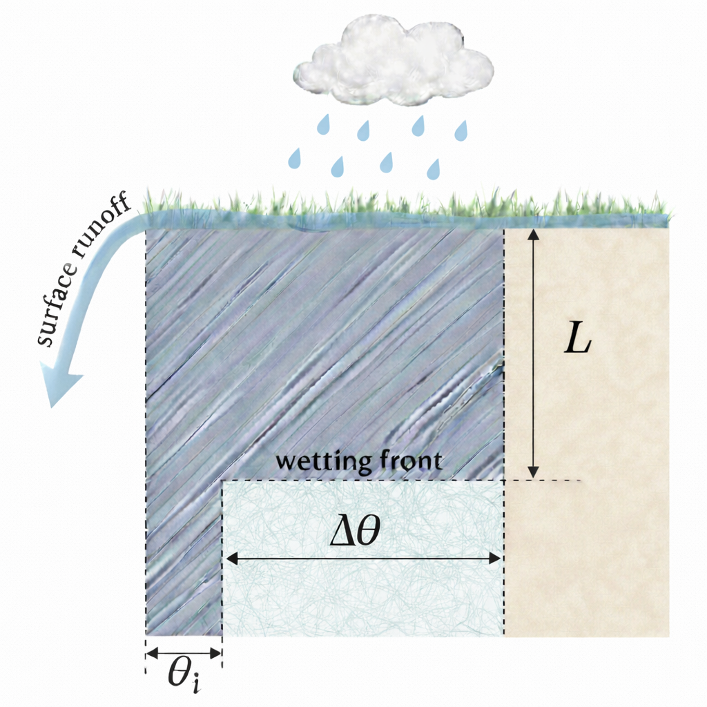
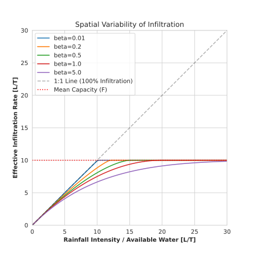

# Soil

## Infiltration and surface runoff

We implement an infiltration scheme based on the Green-Ampt equation [@green1911studies], solving for infiltration capacity physically based on soil properties and moisture deficit.

The Green-Ampt method[@green1911studies] conceptualizes infiltration as a sharp wetting front moving downwards through the soil column. As rain falls, a saturated zone develops at the surface and extends to a depth $L$, known as the *wetting front*. Above this front, the soil is assumed to be fully saturated, while below it, the soil remains at its initial moisture content ($\theta_i$). The difference between saturation and the initial moisture is the moisture deficit $\Delta \theta$.

The driving force for water movement is a combination of gravity and the matric suction (capillary forces) at the wetting front. Initially, when the wetting front is shallow, the suction gradient is high, leading to rapid infiltration. As the front moves deeper (increasing $L$), the suction gradient decreases, and the infiltration rate asymptotically approaches the saturated hydraulic conductivity ($K_{sat}$). If rainfall intensity exceeds this capacity, the excess water generates surface runoff.

The model determines the maximum infiltration capacity ($f_{cap}$) for the current timestep using the explicit Green-Ampt approximation[@sadeghi2024simple]. This avoids the need for iterative solutions or sub-stepping typically required for the implicit Green-Ampt formulation.

The cumulative infiltration $I(t)$ is calculated as:

$$ I(t) = K_{sat} t \left( 0.70635 + 0.32415 \sqrt{1 + 9.43456 \frac{S^2}{K_{sat}^2 t}} \right) $$

Where:
* $I(t)$ is the cumulative infiltration [$L$].
* $K_{sat}$ is the saturated hydraulic conductivity [$L/T$].
* $S^2 = 2 K_{sat} \psi_f \Delta \theta$ is the square of sorptivity [$L^2/T$][@philip1969theory].
* $\psi_f$ is the wetting front suction head [$L$].
* $\Delta \theta$ is the moisture deficit [$ - $].
* $t$ is the time since the start of the infiltration event [$T$].

The model tracks the wetting front depth ($L$). At the beginning of each timestep, the "effective time" ($t_{eff}$) corresponding to the current wetting front is calculated by inverting the standard Green-Ampt equation (exact analytical inversion). The potential cumulative infiltration at $t_{eff} + \Delta t$ is then calculated using the explicit formula above. The difference determines the maximum infiltration capacity for the timestep.

$$f_{cap} = I(t_{eff} + \Delta t) - I(t_{eff})$$

### Spatial Variability of Infiltration

In hydrological modeling, assuming a uniform infiltration capacity and uniform rainfall across a grid cell often leads to an underestimation of surface runoff. Even when the average rainfall intensity is lower than the average infiltration capacity, localized areas within the cell may still generate runoff, for example due to spatial heterogeneity in soil properties (e.g., compaction, crusting), variations in vegetation cover, or sub-grid rainfall variability.

To address this, we use the **Probability Distributed Model (PDM)** principle described by Moore (1985)[@moore1985probability]. Instead of a single value, the infiltration capacity within a cell is assumed to follow a spatial probability distribution, specifically a Reflected Power (or Power-Law) distribution, controlled by a shape parameter beta ($\beta$).

This distribution defines the fraction of the cell area $F(f)$ that has an infiltration capacity less than or equal to $f$:

$$ F(f) = 1 - \left(1 - \frac{f}{f_{max}}\right)^{\beta} $$

Where $f_{max}$ is the maximum local infiltration capacity, related to the mean Green-Ampt capacity ($f_{GA}$) by $f_{max} = f_{GA} \cdot (\beta + 1)$.

The effective infiltration rate for the cell is obtained by integrating this distribution. This allows the model to generate Hortonian runoff from partial areas of the cell even when the mean rainfall intensity is less than the mean infiltration capacity.

### Runoff generation

If the rainfall intensity exceeds this capacity, Hortonian (infiltration excess) runoff is generated.

Infiltration is also limited by the available pore space in the soil column. The model calculates the available storage in the active soil layers (layers reached by the wetting front). If the soil becomes saturated (reaches $W_s$), no further infiltration can occur, and any additional water serves as saturation excess runoff (Dunne runoff).

The actual infiltration for a timestep is determined by the minimum of:

1. The available water on the surface (precipitation + accumulated topwater) [$L$].
2. The Green-Ampt infiltration capacity ($f_{cap}$) [$L$].
3. The available storage in the soil column (up to the wetting front depth or bottom of soil) [$L$].

Any water that does not infiltrate contributes to surface runoff.

## Interflow

Interflow, or lateral subsurface flow, is the movement of water within the soil profile parallel to the land surface. In GEB, interflow is calculated for each soil layer when the soil moisture content exceeds the field capacity. This "free water" is available to move laterally driven by gravity and the slope of the terrain, and then added to the channel in each grid cell.

### Kinematic Wave Approximation

The interflow calculation conceptualizes the hillslope as a draining reservoir. The rate of drainage is determined by the **kinematic wave approximation** for saturated subsurface flow[@sloan1984modeling]. This approach assumes that the hydraulic gradient is approximately equal to the land surface slope and that flow lines are parallel to the soil-bedrock interface.

The physical derivation follows these steps:

1.  **Kinematic Flux**: The discharge per unit width $q$ ($m^2/h$) is defined as:

    $$q = K_{lat} H_w \sin(\beta)$$

    where $H_w$ is the saturated thickness ($m$) and $\beta$ is the slope angle.
2.  **Conversion to storage**: To integrate this into a grid-based volume balance, the saturated thickness $H_w$ is expressed in terms of the "free water" depth ($W_{free}$ in meters) and the drainable porosity ($\phi_d$):

    $$H_w = \frac{W_{free}}{\phi_d}$$

3.  **Grid cell integration**: The total interflow depth produced by a grid cell of length $L$ is the discharge $q$ divided by that length:

    $$\text{Interflow} = \frac{q}{L} = \frac{K_{lat} \sin(\beta) W_{free}}{\phi_d L}$$

### Implementation

The fraction of free water that becomes interflow is controlled by a `storage_coefficient`.

$$
\text{Interflow} = \text{Free Water} \times \text{Storage Coefficient}
$$

where the Storage Coefficient is derived as:

$$
\text{Storage Coeff.} = \left( \frac{K_{lat} \times \text{Slope}}{\phi_d \times L_{hill}} \right) \times \text{Multiplier}
$$

* $K_{lat}$: Lateral saturated hydraulic conductivity ($m/h$).
* $\phi_d$: Drainable porosity ($-$).
* $L_{hill}$: Hillslope length ($m$).
* $\text{Slope}$: Slope of the terrain ($m/m$).
* $\text{Multiplier}$: Calibration factor.

$L_{hill}$ is derived from the drainage density ($D_d$) of the river network:

$$ L_{hill} = \frac{1}{2 D_d} $$

The drainage density is calculated by summing the length of all streams (defined as pixels with > 1 km² upstream area) within the grid cell and dividing by the cell area. To avoid unrealistic values in areas with sparse river networks, the hillslope length is capped at 1000 m.

## Code

::: geb.hydrology.soil
