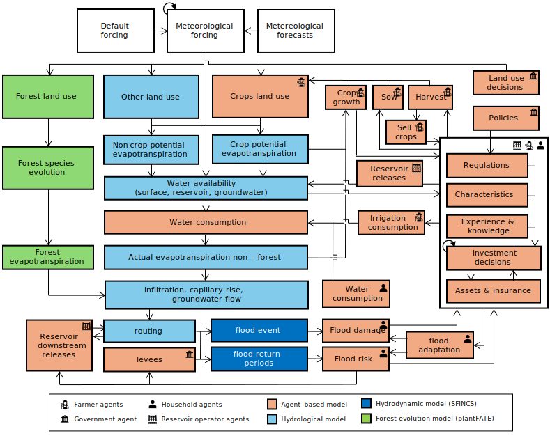

# GEB

GEB (Geographical Environmental and Behavioural model) simulates the environment (e.g., hydrology, floods), the individual people, households and orginizations as well as their interactions at both small and large scale. The model does so through a "deep" coupling of an agent-based model a hydrological model, a vegetation model and a hydrodynamic model. You can find full documentation [here](https://docs.geb.sh/).

The figure below shows a schematic overview of GEB.

## Building on the shoulders of giants

GEB builds on, couples and extends several models, depicted in the figure below.

1.  Burek, Peter, et al. "Development of the Community Water Model (CWatM v1.04) A high-resolution hydrological model for global and regional assessment of integrated water resources management." (2019).
2.  Langevin, Christian D., et al. Documentation for the MODFLOW 6 groundwater flow model. No. 6-A55. US Geological Survey, 2017.
3.  Tierolf, Lars, et al. "A coupled agent-based model for France for simulating adaptation and migration decisions under future coastal flood risk." Scientific Reports 13.1 (2023): 4176.
4.  Streefkerk, Ileen N., et al. "A coupled agent-based model to analyse human-drought feedbacks for agropastoralists in dryland regions." Frontiers in Water 4 (2023): 1037971.
5.  Joshi, Jaideep, et al. "Plant-FATE-Predicting the adaptive responses of biodiverse plant communities using functional-trait evolution." EGU General Assembly Conference Abstracts. 2022.
6.  Leijnse, Tim, et al. "Modeling compound flooding in coastal systems using a computationally efficient reduced-physics solver: Including fluvial, pluvial, tidal, wind-and wave-driven processes." Coastal Engineering 163 (2021): 103796.

