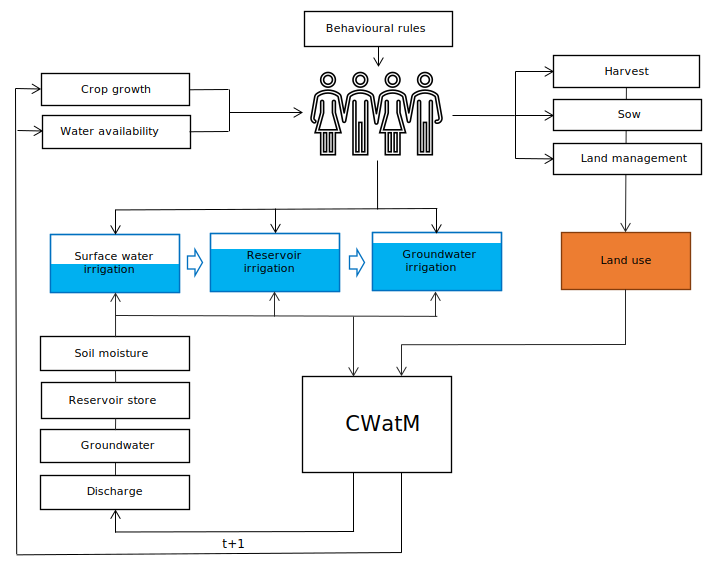

GEB
######################

:Copyright: .. include:: copyright.rst
:Authors: .. include:: authors.rst
:Version: |release|
:Version Date: |today|

Welcome to GEB's documentation! GEB stands for Geographic Environmental and Behavioural model and is named after Geb, the personification of Earth in Egyptian mythology.

GEB aims to simulate both environment, the individual behaviour of people and their interactions at small and large scale. The model does so through a "deep" coupling of an agent-based model which simulates millions individual people or households, a hydrological model, a vegetation model and a hydrodynamic model.

Building on the shoulders of giants
----------------------------------------
GEB builds on, couples and extends several models, depicted in the figure below.

.. image:: images/models_overview.svg

1. Burek, Peter, et al. "Development of the Community Water Model (CWatM v1.04) A high-resolution hydrological model for global and regional assessment of integrated water resources management." (2019).
2. Langevin, Christian D., et al. Documentation for the MODFLOW 6 groundwater flow model. No. 6-A55. US Geological Survey, 2017.
3. Tierolf, Lars, et al. "A coupled agent-based model for France for simulating adaptation and migration decisions under future coastal flood risk." Scientific Reports 13.1 (2023): 4176.
4. Streefkerk, Ileen N., et al. "A coupled agent-based model to analyse human-drought feedbacks for agropastoralists in dryland regions." Frontiers in Water 4 (2023): 1037971.
5. Joshi, Jaideep, et al. "Plant-FATE-Predicting the adaptive responses of biodiverse plant communities using functional-trait evolution." EGU General Assembly Conference Abstracts. 2022.
6. Leijnse, Tim, et al. "Modeling compound flooding in coastal systems using a computationally efficient reduced-physics solver: Including fluvial, pluvial, tidal, wind-and wave-driven processes." Coastal Engineering 163 (2021): 103796.

The figure below shows a schematic overview of some parts of the model, showing the hydrological model and agent-based model. Both models are imported in a single file and run iteratively at a daily timestep.

.. toctree::
  :maxdepth: 1
  :caption: Getting Started

  Installation <installation>
  Configuration <configuration>
  Preprocessing <preprocessing>
  Running the model <running>
  Visualisation <visualisation>

.. toctree::
  :maxdepth: 1
  :caption: Agents
  
  Agents <agents/__init__>
  Farmers <agents/farmers>
  NGO <agents/ngo>
  Government <agents/government>

.. toctree::
  :maxdepth: 2
  :caption: Reference

  Model <model>
  CWatM Model <cwatm_model>
  Report <report>
  Farm-level HRUs <HRUs>
  Artists <artists>

.. toctree::
  :maxdepth: 2
  :caption: About

  Authors <authors_page>
  Updates <updates>