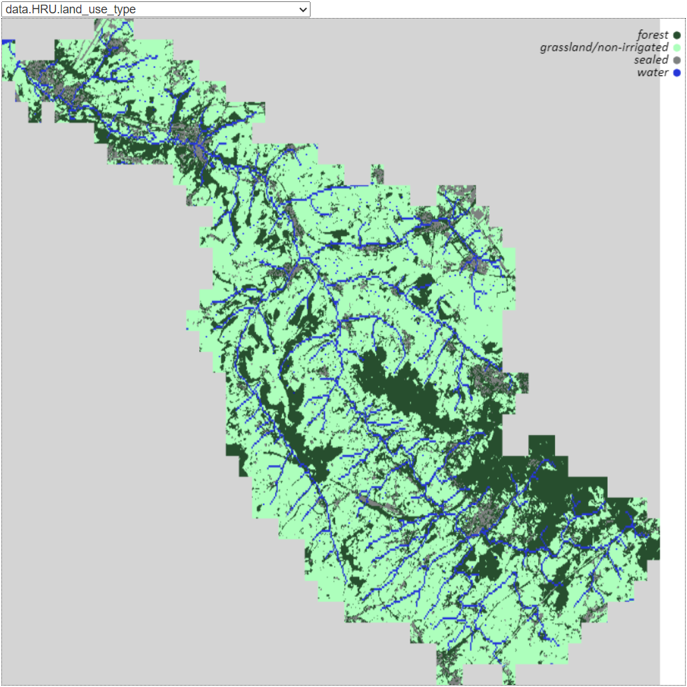

Visualisation
#####################

By passing the "--gui" option to the "geb run" command, the visualisation of the model is started. The visualisation opens in the browser, and allows you to show all the model layers. You can also forward the model in time, and see the changes in the model layers.

.. code-block:: bash

    geb run --gui
    geb run --gui --port 8521
    geb run --gui --no-browser

Optionally, you can pass the `--port` option to specify the port on which the visualisation should be started. The default port is 8521. You can also pass `--no-browser` to prevent the visualisation from automatically opening in the browser. The visualisation can then be opened manually by navigating to the URL shown in the terminal, which can be useful when running the model on a remote server.

An example of the Geul basin in the Netherlands, Germany and Belgium is shown below.

